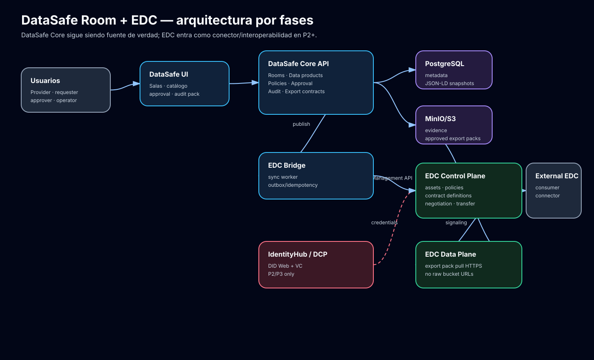
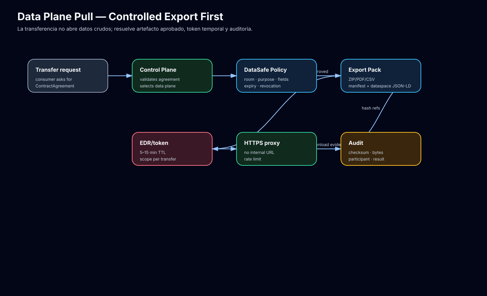
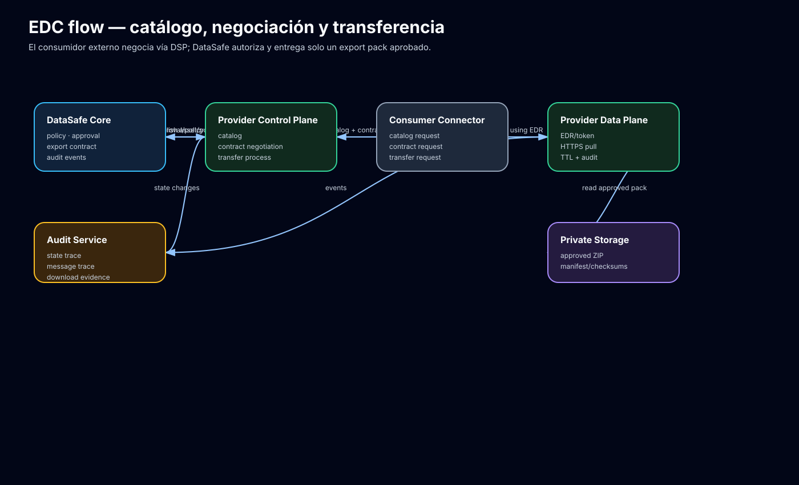
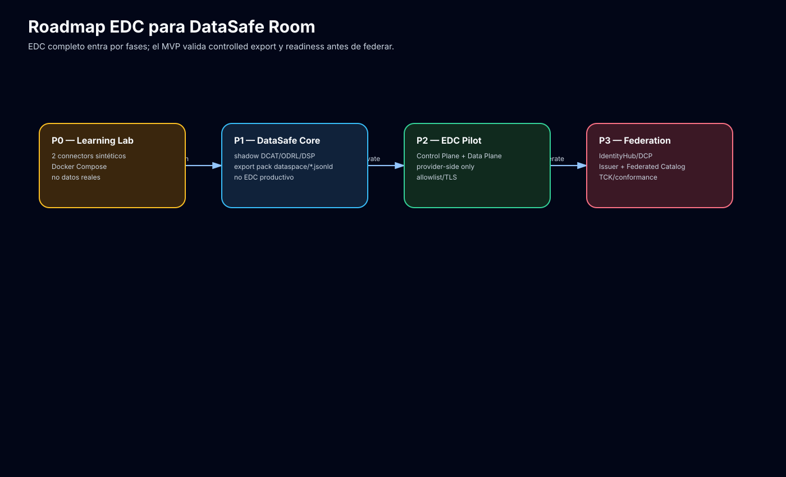

# DataSafe Room — Propuesta de implementación con EDC / IDS Frameworks

> **Nota de interpretación.** La transcripción dice “XID”. En el contexto de DataSafe Room, IDSA/DSP y la conversación anterior, lo interpreto como **EDC — Eclipse Dataspace Components / Eclipse Dataspace Connector** y su ecosistema. Si Ventura se refería a otro framework concreto, esta propuesta queda como base y se ajusta.

## 0. Veredicto ejecutivo

La propuesta correcta es **no convertir DataSafe Room en un EDC puro desde el día uno**. EDC es una caja de herramientas para construir conectores de dataspace; no sustituye el producto DataSafe Room.

Decisión recomendada:

- **DataSafe Core** mantiene la fuente de verdad de negocio: salas, participantes, evidencias, clasificación, aprobación, output requests, export packs y auditoría.
- **EDC** entra como capa de interoperabilidad progresiva: catálogo DSP/DCAT, políticas ODRL, contract negotiation, transfer process y data plane controlado.
- **Controlled Export First** sigue siendo el principio: EDC nunca debe abrir buckets, ERP/MES/SCADA ni datos crudos; solo coordina transferencias de artefactos aprobados.
- **P0/P1:** construir readiness y shadow model EDC/DSP sin runtime EDC productivo.
- **P2:** desplegar EDC provider connector en sandbox/piloto privado.
- **P3:** IdentityHub/DCP, Issuer Service, Federated Catalog, extensiones cloud y conformance cuando exista contraparte real.

No usar comercialmente:

- “Certificado IDSA/Gaia-X/Catena-X”.
- “Compliant” sin TCK/conformance y revisión del dataspace objetivo.
- “Federación completa” sin red real de participantes.
- “Cumplimiento legal automático”.

## 1. Arquitectura objetivo



### 1.1 Principio de arquitectura

DataSafe Room debe tener dos capas:

1. **Producto DataSafe Room:** UX, backend, policy engine propio, aprobación, export builder y audit trail.
2. **Interoperabilidad EDC/DSP:** conector, control plane, data plane, DSP API, policy engine EDC, identity/trust y catálogo federado por fases.

Vista lógica:

```text
DataSafe UI
  -> DataSafe Core API
      -> Room Service
      -> Data Product Registry
      -> Policy + Agreement Service
      -> Output Request + Approval Service
      -> Audit Service
      -> Export Builder Worker
      -> Dataspace Interop Adapter
      -> EDC Bridge / Sync Worker
  -> PostgreSQL
  -> MinIO/S3 privado

EDC P2/P3
  -> EDC Control Plane
  -> EDC Management API privada
  -> EDC Data Plane Framework custom
  -> DSP Protocol API pública controlada
  -> optional IdentityHub/DCP
  -> optional Issuer Service
  -> optional Federated Catalog
```

### 1.2 Qué hace DataSafe y qué hace EDC

**DataSafe Core mantiene:**

- Organización, salas, roles y participantes.
- Data products, versiones, evidencias y clasificación.
- Políticas entendibles por humanos.
- Approval workflow.
- Output requests.
- Export contracts.
- Export/audit packs.
- Logs y trazabilidad de producto.

**EDC aporta:**

- `Asset`, `PolicyDefinition`, `ContractDefinition`.
- Catálogo DSP/DCAT.
- Contract negotiation DSP.
- Contract agreements ODRL.
- Transfer process.
- Data Plane Signaling.
- Policy functions extensibles.
- IdentityHub/DCP para DID/VC cuando se active trust federado.
- Federated Catalog si hay red de participantes.

## 2. Frameworks EDC/IDS y uso recomendado

### 2.1 EDC Connector

Uso:

- Crear una distribución custom **DataSafe EDC Connector** en Java/Gradle cuando lleguemos a P2.
- Arrancar primero en modo **provider-side**.
- Consumer-side solo si DataSafe necesita consumir activos externos.
- Un conector por deployment/piloto, no un conector por sala en MVP.

Extensiones DataSafe necesarias:

- `datasafe-edc-asset-sync`: publica assets desde `DataProductVersion` o `ExportContract`.
- `datasafe-edc-policy-functions`: purpose, room, participant, classification, expiry, export contract.
- `datasafe-edc-dataaddress-resolver`: resuelve asset EDC a export pack aprobado sin revelar bucket/key.
- `datasafe-edc-events`: sincroniza negotiation/transfer events hacia `AuditEvent` y estados internos.
- `datasafe-edc-auth`: tokens de servicio, mTLS/OAuth2/DCP según fase.

### 2.2 Control Plane

Responsabilidad:

- Gestionar assets, políticas, contratos, negociaciones y transfer processes.
- Publicar catálogo solo de recursos `interop_enabled=true`.
- No sustituir el approval gate: para decisiones sensibles debe consultar DataSafe.

Management API privada usada por `EDC Bridge`:

```http
POST   /management/v3/assets
DELETE /management/v3/assets/{id}
POST   /management/v3/policydefinitions
POST   /management/v3/contractdefinitions
POST   /management/v3/catalog/request
POST   /management/v3/contractnegotiations
GET    /management/v3/contractnegotiations/{id}
POST   /management/v3/transferprocesses
GET    /management/v3/transferprocesses/{id}
```

Nota: confirmar paths/payloads contra la versión EDC fijada antes de implementar. La propuesta asume familia Management API v3.

### 2.3 Data Plane Framework

Uso:

- Implementar **DataSafe Export Pack Data Plane**.
- Primer tipo de transferencia: **Consumer Pull HTTPS**.
- El data plane recibe señal del control plane y consulta DataSafe para validar contrato, propósito, participante, TTL y revocación.
- Entrega únicamente export packs aprobados.

Reglas:

- No exponer `minio://bucket/key`.
- No exponer credenciales S3.
- No usar URLs firmadas largas.
- TTL recomendado: 5–15 minutos.
- Registrar `transfer.started`, `transfer.completed`, `transfer.failed`, `artifact.downloaded`.



### 2.4 Policy Engine

P0/P1:

- Enforcement principal en DataSafe Policy Engine.
- Proyección ODRL limitada para export packs y documentación.

P2:

- EDC Policy Engine evalúa access/contract/transfer policies.
- Policy functions llaman a DataSafe para constraints de negocio.

Funciones mínimas:

```text
datasafe.purpose.eq
datasafe.room.allowed
datasafe.organization.eq
datasafe.classification.max
datasafe.field.allowed_export
datasafe.export_contract.valid
datasafe.expiry.before
datasafe.download.count.lt
```

### 2.5 DSP Protocol 2024-1

Uso:

- Target inicial: **IDSA/Eclipse Dataspace Protocol 2024-1**.
- P1 conserva snapshots y `/.well-known/dspace-version` feature-flagged.
- P2 deja que EDC gestione endpoints DSP entre conectores.
- DataSafe mantiene export pack y snapshots para auditoría.

Flujos:



### 2.6 IdentityHub / DCP

Uso:

- No bloquear P0/P1.
- Activar en P2/P3 si el piloto exige trust descentralizado.
- DID Web por participante/conector/issuer.
- VCs organizacionales, no credenciales personales.

Credenciales mínimas para piloto:

- `DataSafeParticipantCredential`.
- `ConnectorCredential`.
- `RoomMembershipCredential`.
- `DataProviderRole` / `DataConsumerRole`.
- `CapabilityCredential` para publicar/consumir ciertas clases de activos.

### 2.7 Issuer Service

Uso:

- P3 o piloto con onboarding formal.
- Emite/revoca VCs tras aprobación.
- No mezclar issuer con aprobación de outputs.
- Debe tener logs, revocación y separación de claves.

### 2.8 Federated Catalog

Uso:

- No P0/P1.
- P2 opcional con allowlist de 1–2 conectores de prueba.
- P3 si existe dataspace real con crawling/cache de catálogos.

Evitar federated catalog si solo tenemos una sala bilateral: añade complejidad sin validar venta.

### 2.9 Technology extensions AWS/Azure/Tractus-X

- **Technology-Aws:** usar solo si el piloto corre en AWS/S3 real.
- **Technology-Azure:** usar solo si el cliente usa Azure Blob/KeyVault/Cosmos.
- **Tractus-X EDC:** considerar solo si el caso es automoción/Catena-X. No adoptarlo para pyme industrial genérica sin necesidad.
- **Hashicorp Vault/PostgreSQL distributions:** útiles para piloto, pero no montar Vault HA sin runbooks y operación.

## 3. Mapping de dominio DataSafe a EDC

| DataSafe | EDC/DSP | Regla |
|---|---|---|
| `Organization` | Participant ID / DID Web | Un participante por organización o deployment según piloto |
| `Room` | Contexto de contract definitions | No crear conector por room en MVP |
| `DataProductVersion` | `Asset` / DCAT Dataset | Solo si `interop_enabled` y aprobado |
| `Policy` | `PolicyDefinition` / ODRL Offer | Proyección limitada al principio |
| `Agreement` | Contract Agreement / ODRL Agreement | No sustituye contrato legal |
| `OutputRequest` | Contract Negotiation shadow | Approval humano si aplica |
| `ExportContract` | ContractAgreement + TransferProcess | Fuente de validez para descarga |
| `ExportArtifact` | DataAddress / EDR target | Endpoint controlado, no bucket interno |
| `AuditEvent` | EDC event mirror | Trazabilidad end-to-end |

## 4. Flujos de implementación

### 4.1 Publicar un activo DataSafe en EDC

1. Provider crea `DataProductVersion`.
2. Se clasifica y se marca `interop_enabled=true`.
3. DataSafe genera `dcat_jsonld_snapshot` y `odrl_policy_snapshot`.
4. `edc_sync_worker` crea/actualiza `Asset`.
5. `edc_sync_worker` publica `PolicyDefinition`.
6. `edc_sync_worker` crea `ContractDefinition`.
7. EDC lo expone vía catálogo DSP a consumidores autorizados.

### 4.2 Negociación entrante

1. Consumer EDC solicita catálogo.
2. Consumer selecciona offer.
3. Consumer inicia contract negotiation.
4. EDC Control Plane recibe solicitud.
5. Extensión/event handler DataSafe crea o vincula `OutputRequest`.
6. DataSafe evalúa policy y, si hace falta, approval humano.
7. Si se aprueba, EDC finaliza `ContractAgreement`.
8. DataSafe crea `ExportContract` auditado.

### 4.3 Transferencia pull

1. Consumer inicia transfer process sobre un agreement.
2. Control Plane selecciona DataSafe Data Plane.
3. Data Plane consulta DataSafe: agreement, room, purpose, export contract, TTL, revocación.
4. DataSafe devuelve export pack aprobado o deniega.
5. Data Plane entrega EDR/URL/token temporal.
6. Consumer descarga por HTTPS.
7. DataSafe audita bytes, checksum, participant, agreement y resultado.

## 5. Topología de despliegue

### Fase 0 — Landing actual

- Coolify + Nginx + React/Vite estático.
- Sin EDC productivo.
- Sin datos reales.

### Fase 1 — Local/dev lab

Servicios Docker Compose:

- `edc-provider-control-plane`.
- `edc-provider-data-plane`.
- `edc-consumer-control-plane`.
- `postgres`.
- `minio`.
- `prometheus/grafana` opcional.

Objetivo: aprender EDC, crear asset/policy/contract definition, negociar y transferir un artefacto sintético con checksum.

### Fase 2 — Demo integrada / piloto privado

Servicios:

- DataSafe API.
- DataSafe Worker.
- PostgreSQL.
- MinIO/S3.
- EDC Provider Control Plane.
- EDC Provider Data Plane.
- Gateway/TLS/allowlist.
- Logs y métricas.

Management API: privada. DSP API: pública controlada solo para contraparte.

### Fase 3 — Federación controlada

Añadir si existe demanda:

- IdentityHub.
- Issuer Service.
- Federated Catalog.
- Vault/KMS maduro.
- Kubernetes/Helm si el cliente lo exige.
- TCK/conformance.
- Pentest y runbooks.



## 6. Seguridad y trust

### 6.1 Separar identidades

- **Humanos:** Keycloak/Entra/OIDC/MFA para UI y operación.
- **Participantes dataspace:** DID Web + VC + DCP cuando se active federación.
- **Servicios internos:** tokens de servicio, mTLS o workload identity.

### 6.2 Controles mínimos

- Management API de EDC nunca pública.
- DSP API detrás de TLS, gateway, rate limit y allowlist.
- No loggear EDR completo, tokens, presigned URLs ni headers `Authorization`.
- Vault/Secret Manager para claves DID/VC/JWT, client secrets y credenciales storage.
- EDR/token con TTL corto y scope por agreement/asset/transfer.
- Revocar tokens al suspender contrato, cerrar sala o detectar incidente.
- `404`/errores opacos para evitar enumeración.
- Audit trail de identidad, policy decision, contract negotiation, transfer process y descarga.

### 6.3 Amenazas principales

- Exposición accidental de Management API.
- Catálogo filtrando assets o metadatos sensibles.
- EDR/token reutilizable o loggeado.
- URL interna de MinIO/S3 filtrada en `DataAddress`.
- VC/DID mal validada o issuer no autorizado.
- Approval bypass: EDC acepta contrato sin pasar por DataSafe.
- Drift entre estado EDC y estado DataSafe.

## 7. Roadmap de implementación

### P0 — EDC Learning Lab, sin producto real

Objetivo: aprender EDC sin riesgo.

Entregables:

- `docs/edc-lab/README.md` con comandos.
- Docker Compose de dos conectores sintéticos.
- PostgreSQL y MinIO local.
- Asset sintético.
- PolicyDefinition simple.
- ContractDefinition.
- Catalog request.
- Contract negotiation.
- Transfer process pull.
- Checksum verificado.

Criterio de éxito:

- Se negocia y transfiere un fichero sintético entre provider y consumer EDC local.
- No hay datos reales ni endpoints públicos.

### P1 — DataSafe Core + EDC shadow model

Objetivo: que DataSafe sea EDC-ready sin runtime EDC productivo.

Entregables:

- IDs URI/URN estables.
- `dcat_jsonld_snapshot`.
- `odrl_policy_snapshot`.
- `contract_agreement_snapshot`.
- `transfer_process_snapshot`.
- Export pack con `dataspace/*.jsonld`.
- `interop_publications`.
- Tests de no leakage.

Criterio de éxito:

- Un export pack aprobado contiene DCAT/ODRL/DSP JSON-LD y checksums.
- No contiene URLs internas, secrets, tokens permanentes ni datos no aprobados.

### P2 — EDC Provider Pilot

Objetivo: interoperabilidad real acotada.

Entregables:

- DataSafe EDC Connector provider-side.
- Control Plane con Management API privada.
- Data Plane custom para export packs.
- `edc_bridge` y `edc_sync_worker`.
- Policy functions DataSafe.
- DSP API allowlisted.
- Observabilidad mínima.

Criterio de éxito:

- Un consumer EDC externo consulta catálogo, negocia contrato y descarga un export pack aprobado.
- DataSafe registra todo el flujo en audit trail.

### P3 — Trust/federation

Objetivo: entrar en dataspace real.

Entregables:

- IdentityHub/DCP.
- DID Web por participante.
- Issuer Service o issuer externo validado.
- VCs de participante/rol/capability.
- Federated Catalog si existe red.
- TCK/conformance según versión objetivo.
- Hardening/pentest/runbooks.

Criterio de éxito:

- Interoperación repetible con conectores externos bajo trust framework documentado.
- No se prometen certificaciones sin evidencias.

## 8. Plan de tareas inicial P0/P1

### Task 1 — Crear laboratorio EDC local

- Crear `docs/edc-lab/README.md`.
- Crear `ops/edc-lab/docker-compose.yml`.
- Definir provider/consumer CP/DP, PostgreSQL y MinIO.
- Añadir `.env.example` sin secretos.
- Verificar `docker compose config`.

### Task 2 — Crear dataset sintético y export pack mínimo

- Crear `docs/edc-lab/sample-data/`.
- Generar CSV/JSON sintético PCF.
- Generar manifest con checksum SHA-256.
- Crear ZIP aprobado de demo.

### Task 3 — Definir mapping DataSafe→EDC en JSON

- Crear templates:
  - `asset.template.json`.
  - `policydefinition.template.json`.
  - `contractdefinition.template.json`.
- Validar que ningún template expone bucket/key interno.

### Task 4 — Publicar asset/policy/contract en provider EDC

- Crear scripts `scripts/edc-lab/publish_asset.sh`.
- Crear scripts `scripts/edc-lab/publish_policy.sh`.
- Crear scripts `scripts/edc-lab/publish_contract_definition.sh`.
- Verificar idempotencia.

### Task 5 — Ejecutar catalog/negotiation/transfer

- Crear scripts para consumer:
  - catalog request.
  - contract negotiation.
  - transfer process.
- Verificar checksum del fichero recibido.
- Documentar comandos y outputs esperados.

### Task 6 — Diseñar `edc_bridge` P1

- Crear plan de módulo backend, aunque aún no se implemente.
- Definir tablas `interop_publications`, `edc_sync_jobs`, `edc_event_log`.
- Definir estados y reintentos.

### Task 7 — Tests de seguridad documental

- Test de no leakage en JSON-LD/export pack.
- Test de TTL y token redaction.
- Checklist de Management API no pública.

## 9. Decisiones abiertas

- Versión concreta de EDC a fijar para el lab.
- FastAPI vs Spring Boot para DataSafe Core.
- Si P0 usa imágenes/builds EDC propios o distribución tipo Tractus-X para acelerar pruebas.
- Si el primer piloto requiere DID/VC/DCP real o basta OIDC/allowlist.
- Cloud objetivo: VPS/Coolify, AWS, Azure o Kubernetes gestionado.
- Si DataSafe opera un IdentityHub/Issuer propio o se integra con un trust framework externo.

## 10. Riesgos y mitigaciones

- **Riesgo:** EDC consume tiempo antes de validar negocio.
  **Mitigación:** P0 lab time-boxed y P1 DataSafe Core primero.

- **Riesgo:** EDC se convierte en backend de producto accidental.
  **Mitigación:** DataSafe Core fuente de verdad; EDC solo interoperabilidad.

- **Riesgo:** catálogo/transfer filtra datos internos.
  **Mitigación:** no leakage tests, DataAddress resolver, proxy controlado, TTL corto.

- **Riesgo:** complejidad DCP/IdentityHub prematura.
  **Mitigación:** activarlo solo en P2/P3 o si piloto lo exige.

- **Riesgo:** claims comerciales sobre compliance.
  **Mitigación:** lenguaje de readiness/interoperabilidad, no certificación.

## 11. Criterios de aceptación global

DataSafe Room puede decir que tiene propuesta EDC seria cuando:

1. Existe EDC lab reproducible con dos participantes sintéticos.
2. DataSafe genera snapshots DCAT/ODRL/DSP y export pack `dataspace/*.jsonld`.
3. Management API queda privada.
4. DSP API queda controlada por allowlist/TLS.
5. Data Plane entrega solo export packs aprobados.
6. No hay URLs internas, secrets ni tokens permanentes en catálogos, logs o export packs.
7. Contract negotiation/transfer quedan auditados en DataSafe.
8. Las fases P0/P1/P2/P3 tienen gates explícitos.
9. IdentityHub/DCP/Federated Catalog no se activan sin necesidad real.
10. No se promete certificación sin TCK/conformance.

## 12. Fuentes y revisiones usadas

- Revisión delegada Daedalus / EDC Backend Architect.
- Revisión delegada Aegis / Security-Trust Architect.
- Revisión delegada Hephaestus / DevOps Architect.
- Revisión delegada Mimir / Technical Diagrams + UX.
- `docs/software/datasafe-room-technical-specification-2026-05-07.md`.
- `docs/software/datasafe-room-dsp-alignment-proposal-2026-05-07.md`.
- `docs/software/datasafe-room-edc-implementation-proposal-2026-05-07.md`.
- `docs/software/datasafe-room-edc-deployment-operations-proposal-2026-05-07.md`.
- `docs/software/datasafe-room-edc-trust-security-analysis-2026-05-07.md`.
- `docs/software/datasafe-room-edc-technical-diagrams-ux-2026-05-07.md`.
- Eclipse EDC Connector: https://github.com/eclipse-edc/Connector
- Eclipse EDC Samples: https://github.com/eclipse-edc/Samples
- Eclipse EDC Documentation: https://eclipse-edc.github.io/documentation/for-adopters/
- EDC Control Plane docs: https://eclipse-edc.github.io/documentation/for-adopters/control-plane/
- EDC Data Plane docs: https://eclipse-edc.github.io/documentation/for-adopters/data-plane/
- EDC IdentityHub: https://github.com/eclipse-edc/IdentityHub
- Tractus-X EDC: https://github.com/eclipse-tractusx/tractusx-edc
