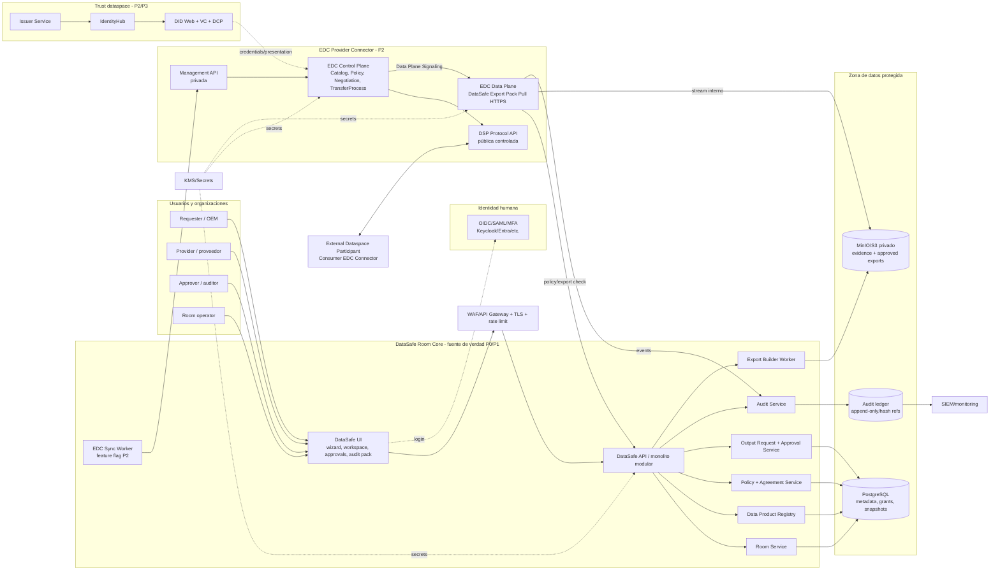
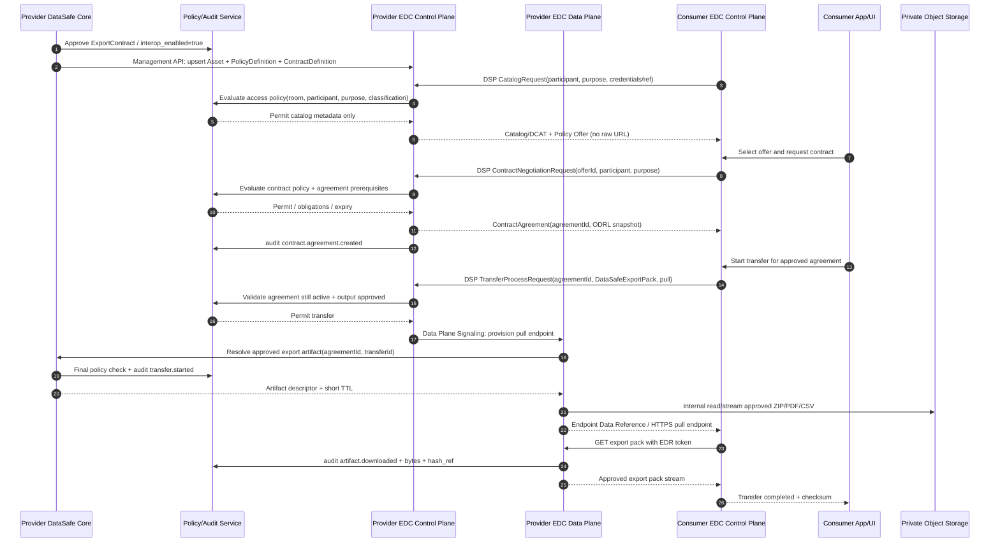
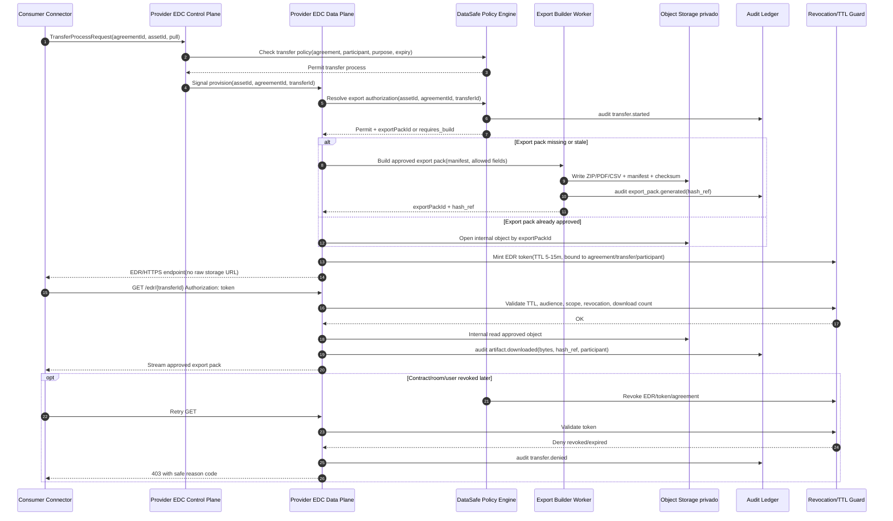
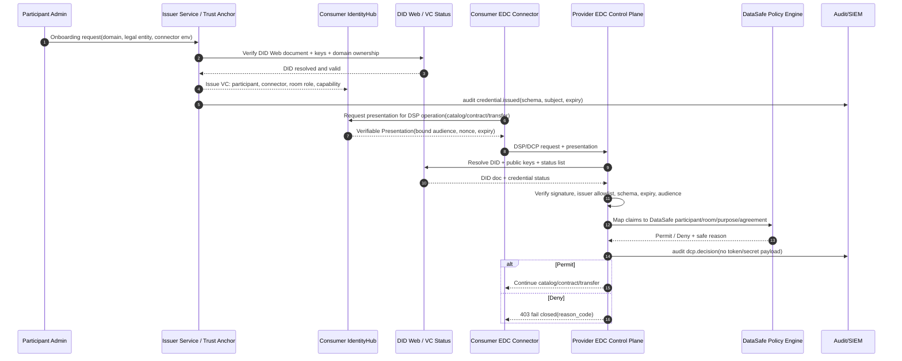
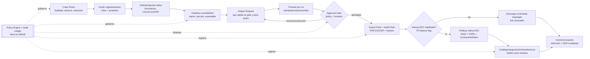
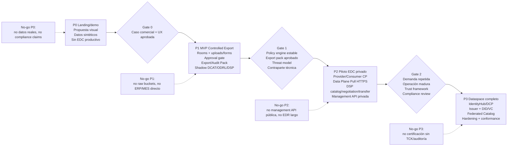

# DataSafe Room + EDC — Diagramas técnicos y UX para Ventura

## 0. Mensaje visual principal

La propuesta debe enseñar a Ventura una evolución en dos velocidades:

- **Producto DataSafe Room:** salas, participantes, evidencias, policies, aprobaciones, controlled export y audit pack. Es el núcleo del MVP.
- **Interoperabilidad EDC/DSP:** catálogo, negociación, contrato, transfer process, data plane, IdentityHub/DCP y catálogo federado. Se activa por fases cuando exista contraparte real.

Regla de narrativa en todos los diagramas: **Controlled Export First**. EDC no abre buckets ni datos crudos; EDC coordina contratos y transferencias de artefactos ya aprobados por DataSafe.

## 1. Set de diagramas a crear

### Diagrama A — Arquitectura de componentes DataSafe + EDC por fases

**Objetivo:** explicar que DataSafe Core sigue siendo la fuente de verdad de negocio y que EDC entra como sidecar/frontera de interoperabilidad, no como sustituto del producto.

**Nivel:** C4 Container / logical architecture.

**Fase recomendada:** P0/P1 como diseño; EDC real a partir de P2.

**Nodos:**

- Usuarios humanos: requester/OEM, provider/proveedor, approver/auditor, room operator.
- DataSafe UI: wizard, workspace, approvals, audit pack.
- DataSafe API/Core: room service, data product registry, policy/agreement service, output request service, approval service, audit service, export builder, EDC sync worker.
- Persistencia: PostgreSQL, object storage privado, audit ledger.
- Identidad humana: OIDC/SAML/MFA.
- EDC provider connector: Control Plane, Management API privada, DSP Protocol API pública controlada.
- EDC Data Plane: export pack data plane, endpoint pull HTTPS, data plane signaling.
- Consumer externo: EDC connector / dataspace participant.
- Identidad dataspace P3: IdentityHub, Issuer Service, DID Web/VC/DCP.
- Observabilidad/seguridad: WAF/API gateway, secrets/KMS, SIEM.

**Flechas clave:**

- Usuario → UI → DataSafe API: operación del producto.
- DataSafe API → Policy Engine/Audit/Storage: enforcement y trazabilidad.
- EDC Sync Worker → EDC Management API: publica asset/policy/contract definition cuando `interop_enabled=true`.
- Consumer EDC ↔ Provider EDC DSP API: catálogo, negociación y transferencia.
- EDC Control Plane → Data Plane: signaling de transferencia.
- Data Plane → DataSafe API/Policy/Export Builder: resuelve solo export pack aprobado.
- Data Plane → Object Storage: acceso interno, nunca URL cruda al consumidor.
- IdentityHub/DCP → EDC Policy Engine: credenciales y confianza de participante solo en fases P2/P3.

---

### Diagrama B — Secuencia provider/consumer: catalog → negotiation → transfer

**Objetivo:** mostrar el flujo interoperable EDC completo sin perder la decisión de producto: la transferencia solo llega a un artefacto aprobado.

**Nivel:** sequence diagram.

**Fase recomendada:** P2 sandbox/piloto privado.

**Participantes/nodos:**

- Provider DataSafe Core.
- Provider EDC Control Plane.
- Provider EDC Data Plane.
- Consumer EDC Control Plane.
- Consumer App/DataSafe UI externa.
- Policy Engine/Audit.
- Object Storage privado.

**Mensajes principales:**

1. DataSafe marca `DataProductVersion` o `ExportContract` como publicable.
2. EDC Sync Worker crea/actualiza `Asset`, `PolicyDefinition` y `ContractDefinition` en Management API.
3. Consumer solicita catálogo por DSP.
4. Provider responde `Catalog`/DCAT con `Dataset`, `Distribution`, `Policy Offer`; sin URL de storage.
5. Consumer inicia `ContractNegotiation`.
6. Provider evalúa access policy y contract policy contra DataSafe.
7. Se crea `ContractAgreement`.
8. Consumer inicia `TransferProcess`.
9. Provider Control Plane valida acuerdo y dispara Data Plane Signaling.
10. Data Plane emite EDR/endpoint pull temporal o stream controlado.
11. Consumer descarga export pack.
12. Provider registra eventos de transferencia y checksum.

---

### Diagrama C — Data Plane Pull Export: detalle Controlled Export First

**Objetivo:** explicar a negocio y seguridad que el Data Plane no es una puerta al bucket. Es un proxy/control de descarga de export packs aprobados.

**Nivel:** sequence diagram técnico-operativo.

**Fase recomendada:** P2 inicial.

**Nodos:**

- Consumer EDC/Data Plane client.
- Provider EDC Control Plane.
- Provider EDC Data Plane.
- DataSafe Policy Engine.
- Export Builder Worker.
- Storage privado.
- Audit Ledger.
- Revocation/TTL guard.

**Mensajes/flechas:**

- Consumer pide pull transfer.
- Control Plane valida `ContractAgreement` y `TransferPolicy`.
- Data Plane solicita un artifact descriptor a DataSafe.
- Policy Engine comprueba room, purpose, participant, classification, expiry, download count, approved output.
- Si el export pack no existe o está obsoleto, Export Builder lo genera.
- Data Plane entrega stream o URL firmada de 5–15 min, nunca `minio://bucket/key`.
- Cada descarga registra bytes, hash, acuerdo, participante y resultado.
- Revocación invalida EDR/token y bloquea descargas posteriores.

---

### Diagrama D — Trust e identidad: DCP / IdentityHub / DID Web

**Objetivo:** separar identidad humana de identidad de participante dataspace. Ventura debe ver que Keycloak/OIDC no sustituye DCP/IdentityHub cuando haya interoperabilidad real, y que DCP no sustituye approvals de DataSafe.

**Nivel:** trust flow / sequence diagram.

**Fase recomendada:** diseño P1, piloto acotado P2, operación completa P3.

**Nodos:**

- Participant admin / onboarding.
- Issuer Service DataSafe o trust anchor.
- IdentityHub del provider/consumer.
- DID Web documents.
- Consumer EDC Connector.
- Provider EDC Control Plane.
- DataSafe Policy Engine.
- Audit/SIEM.

**Mensajes/flechas:**

1. Organización se da de alta y demuestra dominio/control legal.
2. Issuer emite credenciales verificables: `DataSafeParticipantCredential`, `ConnectorCredential`, `RoomMembershipCredential`, `DataProviderRole`/`DataConsumerRole`.
3. IdentityHub custodia credenciales.
4. En una petición DSP/DCP, el consumer presenta VC(s) y DID.
5. Provider resuelve DID Web, valida firma, issuer, schema, status/revocación, expiración y audience.
6. EDC Policy Engine llama a DataSafe para mapear claims a room/participant/purpose/agreement.
7. Si todo coincide, catálogo/contrato/transferencia continúa; si no, falla cerrado.
8. Se auditan decisiones sin loggear tokens completos ni secretos.

---

### Diagrama E — UX de sala: lo que ve Ventura vs lo que hace EDC detrás

**Objetivo:** traducir EDC a experiencia de producto. Los usuarios no deben operar conceptos de EDC directamente salvo en una pantalla avanzada de interoperabilidad.

**Nivel:** product/UX flow.

**Fase recomendada:** P0/P1 para MVP; anotaciones P2 detrás de feature flag.

**Pantallas/nodos UX:**

- Crear sala.
- Definir finalidad, participantes y retención.
- Solicitar/aportar campos y evidencias.
- Clasificar sensibilidad.
- Crear Output Request.
- Preview por rol.
- Approval gate.
- Export/Audit Pack.
- Opcional P2: publicar como oferta EDC.
- Opcional P2: ver contratos/transferencias EDC.
- Cierre/revocación.

**Flechas UX y backend:**

- Crear sala → acuerdos humanos → grants internos.
- Subir evidencia → clasificación → no publicable por defecto.
- Output Request → policy check → revisión humana → export pack aprobado.
- Botón avanzado “Publicar oferta interoperable” solo si export pack aprobado y `interop_enabled=true`.
- EDC Sync Worker crea asset/policy/contract definition.
- Transferencias externas aparecen como eventos del audit pack.

**Copy UX recomendado para Ventura:**

- En pantallas normales usar “salida aprobada”, “paquete de auditoría”, “oferta interoperable”, “participante externo”.
- En modo avanzado usar términos EDC entre paréntesis: “Oferta interoperable (EDC Asset + Contract Definition)”, “Acuerdo técnico (Contract Agreement)”, “Transferencia controlada (Transfer Process)”.
- Evitar vender “conexión automática al ERP/MES” en MVP. Decir “subida o exportación controlada primero; conectores después”.

---

### Diagrama F — Roadmap P0–P3: Controlled Export First → EDC completo

**Objetivo:** ordenar ambición y coste. EDC completo se gana por gates, no se promete desde el día uno.

**Nodos/fases:**

- **P0 — Landing/demo comercial:** narrativa, mockups, documentos, sin datos reales ni EDC productivo.
- **P1 — MVP Controlled Export:** salas, uploads, approvals, export/audit pack; shadow model DCAT/ODRL/DSP; Management API/EDC no productivo.
- **P2 — Piloto EDC privado:** provider connector, consumer de demo o contraparte real, Control Plane/Data Plane separados, pull HTTPS, políticas EDC delegadas a DataSafe, management privada.
- **P3 — Dataspace federado:** IdentityHub/DCP, issuer, DID/VC, catálogo federado, multi-participante, hardening, conformance/TCK si aplica.

**Flechas/gates:**

- P0 → P1: caso de negocio y UX validada.
- P1 → P2: export pack estable, policy engine maduro, threat model, contraparte técnica.
- P2 → P3: contratos reales, operación 24/7, seguridad/compliance revisados, necesidad federada.
- Cada fase tiene un “no-go” para evitar sobrepromesa.

## 2. Orden recomendado dentro del Markdown/PDF final

1. **Página 1 — Decisión ejecutiva:** DataSafe Core primero, EDC progresivo, Controlled Export First.
2. **Página 2 — Arquitectura de componentes:** Diagrama A.
3. **Página 3 — Flujo interoperable EDC:** Diagrama B.
4. **Página 4 — Pull export seguro:** Diagrama C.
5. **Página 5 — Trust e identidad:** Diagrama D.
6. **Página 6 — UX de usuario:** Diagrama E.
7. **Página 7 — Roadmap:** Diagrama F.
8. **Apéndice — Glosario:** Asset, PolicyDefinition, ContractDefinition, ContractAgreement, TransferProcess, EDR, IdentityHub, DCP, DID Web, VC.

## 3. Glosario visual corto para Ventura

- **DataSafe Room:** sala de colaboración con finalidad, participantes, políticas, aprobaciones y auditoría.
- **Controlled Export:** salida concreta aprobada, empaquetada y trazable; no acceso libre al dato crudo.
- **Export Pack:** ZIP/PDF/CSV autorizado, con manifest, checksum y restricciones.
- **Audit Pack:** evidencia de quién pidió, quién aprobó, qué se exportó, hashes y eventos.
- **EDC Control Plane:** componente que publica catálogo, negocia contratos y controla transferencias.
- **EDC Data Plane:** componente que entrega el artefacto aprobado mediante endpoint temporal/controlado.
- **DSP:** protocolo de interoperabilidad entre conectores dataspace.
- **ODRL:** lenguaje de políticas machine-readable usado para ofertas/acuerdos.
- **DCAT:** modelo de catálogo/dataset/distribution.
- **EDR:** Endpoint Data Reference; referencia temporal para descargar/consumir un artefacto autorizado.
- **IdentityHub/DCP:** wallet y protocolo para presentar/verificar credenciales de participante.
- **DID Web/VC:** identidad descentralizada y credenciales verificables para organizaciones/conectores.

## 4. Decisiones de diseño que deben quedar visibles

- **EDC no reemplaza la UI ni los workflows de aprobación.** Coordina interoperabilidad.
- **EDC Management API nunca es pública.** Solo la toca el worker interno.
- **El catálogo nunca publica URLs internas ni keys de storage.** Publica metadatos y políticas.
- **El Data Plane entrega export packs aprobados.** No datos crudos por defecto.
- **DCP/IdentityHub se separa de OIDC humano.** OIDC autentica usuarios; DCP acredita participantes/conectores.
- **MVP no necesita EDC productivo.** Debe ser EDC-ready: DCAT/ODRL/DSP shadow model, IDs, snapshots y políticas limpias.
- **EDC completo requiere gates.** Contraparte real, threat model, operación, secretos, logs, revocación y compliance review.

## 5. Checklist para pasar estos diagramas a arte final

- Usar color por capa:
  - Azul: UX/DataSafe Core.
  - Morado: EDC Control Plane.
  - Naranja: EDC Data Plane.
  - Verde: trust/identity.
  - Gris: storage/audit/infra.
- Marcar P0/P1/P2/P3 en cada caja opcional.
- Poner candados en Management API, Object Storage y KMS.
- Poner etiqueta “no raw storage URL” en catálogo y data plane.
- En secuencias, resaltar con borde grueso: `Policy check`, `Approval gate`, `Audit event`, `Short TTL`.
- En la versión ejecutiva, mantener máximo 6 diagramas; mover detalles de payload/API a apéndice.
