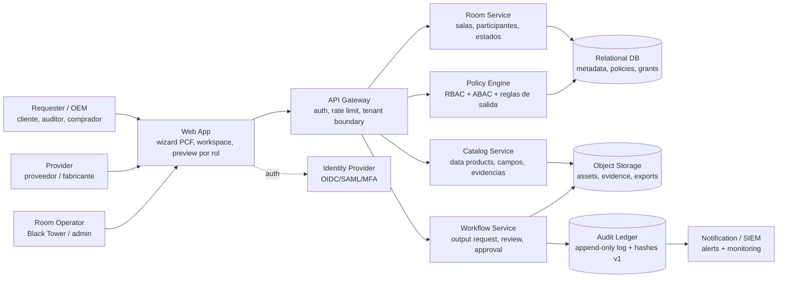
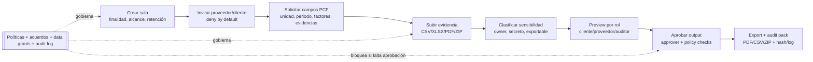
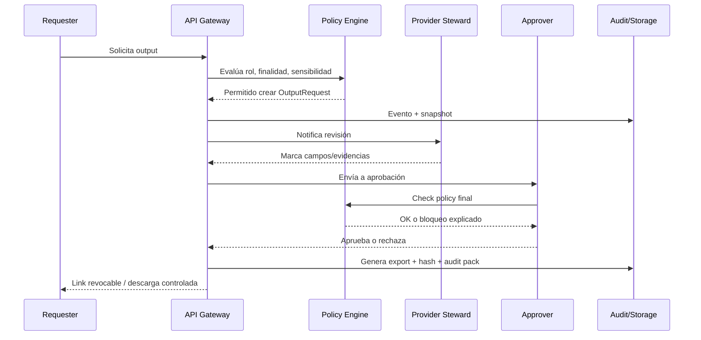
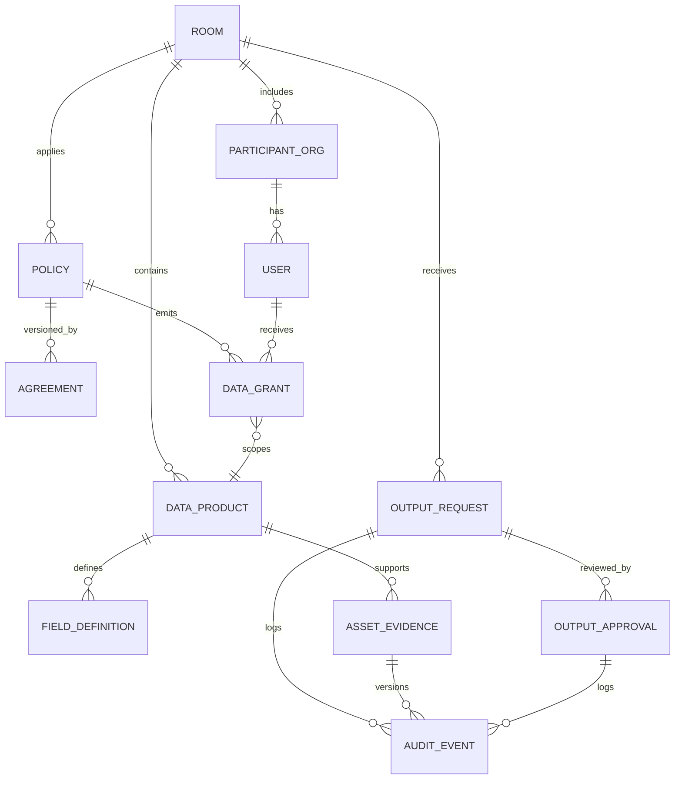
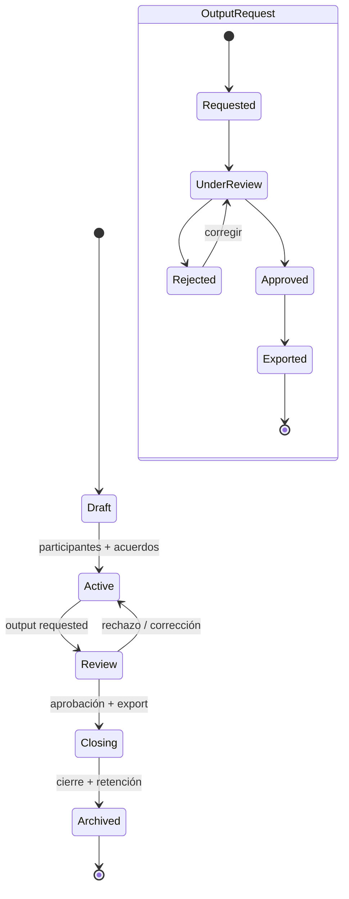
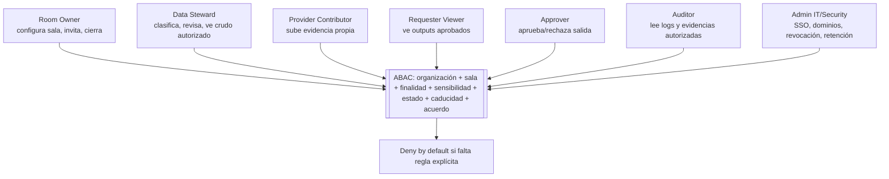
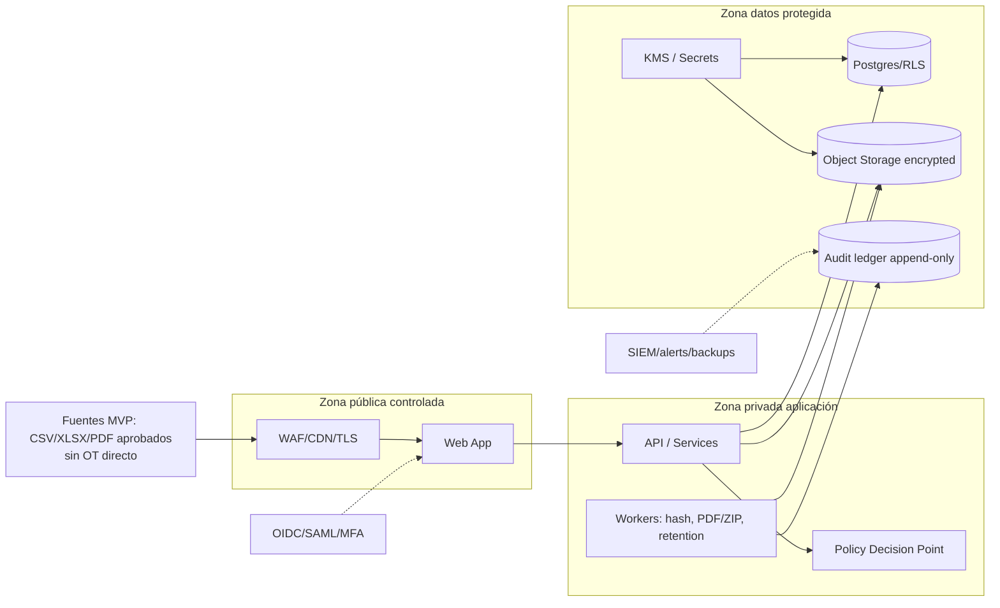
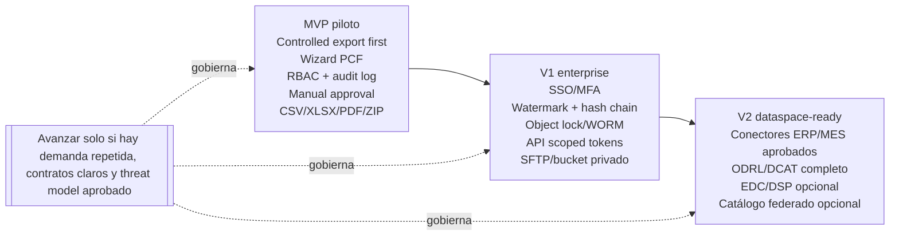

# DataSafe Room — Technical Diagrams + UX Flow

> Documento interno para explicar a Ventura la arquitectura técnica y el flujo UX de DataSafe Room. El objetivo es que producto, negocio, seguridad y desarrollo compartan el mismo mapa mental antes de construir el MVP.

## Lectura ejecutiva

DataSafe Room se modela como una **sala controlada de colaboración industrial**: cada sala tiene finalidad, participantes, datos mínimos, políticas, acuerdos, aprobaciones de salida y auditabilidad. El MVP debe evitar integraciones OT/ERP directas: empieza con **controlled export first** mediante formularios y uploads aprobados.

## Entidades clave

- **Room:** sala/caso con finalidad, alcance, participantes, estado y retención.
- **Participants:** organizaciones y usuarios con rol por sala.
- **Data Products:** datasets lógicos solicitados o aportados.
- **Assets/Evidence:** archivos, certificados, tablas, declaraciones o documentos versionados.
- **Policies:** permisos, prohibiciones, obligaciones y condiciones machine-readable.
- **Agreements:** aceptación humana/legal versionada.
- **Output Requests:** solicitudes de informe, vista, CSV/PDF/ZIP o audit pack.
- **Approval:** revisión y aprobación/rechazo de salida.
- **Audit Log:** eventos no editables desde UI.
- **Audit Pack:** paquete final con output, evidencias autorizadas, versiones, aprobaciones, hashes y logs.

## Flujo PCF de referencia

Crear sala → invitar proveedor/cliente → solicitar campos → subir evidencia → clasificar sensibilidad → preview por rol → aprobar output → export/audit pack → cierre/retención.

## 1. Arquitectura C4 / Container

**Qué comunica:** Muestra los contenedores lógicos que debe entender Ventura: Web App, API, servicios de sala/catálogo/políticas/workflow, almacenamiento, auditoría e identidad. La decisión técnica principal es que ningún acceso vaya directo a datos: todo pasa por API + Policy Engine.

**Fuente Mermaid editable:** `docs/software/datasafe-room-diagrams-assets/01-c4-container.mmd`

## 2. Flujo de datos PCF / UX end-to-end

**Qué comunica:** Traduce el caso PCF en una experiencia completa. El usuario no piensa en “dataspaces”; piensa en una sala, campos solicitados, evidencias, clasificación, preview, aprobación y pack final.

**Fuente Mermaid editable:** `docs/software/datasafe-room-diagrams-assets/02-data-flow-pcf.mmd`

## 3. Secuencia de aprobación y export

**Qué comunica:** Aclara quién interviene cuando alguien pide una salida. La exportación no es un botón simple: crea solicitud, evalúa política, revisa steward, aprueba approver, genera hash y registra eventos.

**Fuente Mermaid editable:** `docs/software/datasafe-room-diagrams-assets/03-approval-export-sequence.mmd`

## 4. Modelo de dominio / ER conceptual

**Qué comunica:** Define el núcleo de datos del MVP. Room es el aggregate operativo; Policies/Agreements/DataGrant separan contrato, regla y autorización concreta; OutputRequest y AuditEvent cierran la trazabilidad.

**Fuente Mermaid editable:** `docs/software/datasafe-room-diagrams-assets/04-domain-er-model.mmd`

## 5. Máquina de estados

**Qué comunica:** Evita ambigüedad de producto: una sala pasa de Draft a Active, Review, Closing y Archived. Un OutputRequest puede quedar Requested, UnderReview, Rejected, Approved o Exported.

**Fuente Mermaid editable:** `docs/software/datasafe-room-diagrams-assets/05-state-machines.mmd`

## 6. Matriz de permisos MVP

**Qué comunica:** Da una vista comprensible de RBAC para negocio y recuerda que el enforcement real debe ser ABAC: organización, sala, finalidad, sensibilidad, estado, caducidad y acuerdos aceptados.

**Fuente Mermaid editable:** `docs/software/datasafe-room-diagrams-assets/06-permission-matrix.mmd`

## 7. Arquitectura de infraestructura

**Qué comunica:** Plantea una infraestructura cloud/VPC segura para MVP: zona pública controlada, zona privada de aplicación, zona de datos protegida, KMS, SIEM y backups. Se explicita “sin OT directo” para reducir riesgo.

**Fuente Mermaid editable:** `docs/software/datasafe-room-diagrams-assets/07-infra-architecture.mmd`

## 8. Evolución MVP / V1 / V2

**Qué comunica:** Ordena la ambición: MVP vendible con exports controlados; V1 enterprise con SSO, watermark, hash chain, WORM y APIs; V2 dataspace-ready con conectores y estándares si el mercado lo justifica.

**Fuente Mermaid editable:** `docs/software/datasafe-room-diagrams-assets/08-roadmap-mvp-v1-v2.mmd`

## Decisiones técnicas que se desprenden de los diagramas

- **Controlled Export First:** el MVP acepta uploads/formularios y exports aprobados; evita conexiones directas a PLC/SCADA/MES/ERP.
- **Deny by default:** invitación no implica acceso; cada permiso depende de sala, rol, finalidad, sensibilidad y estado.
- **Separar ver, revisar y aprobar:** quien aporta evidencia no necesariamente aprueba salida; quien ve output no ve datos crudos.
- **Policy Engine desde el MVP:** aunque sea simple, debe existir como punto explícito de decisión para no mezclar reglas en pantallas.
- **Audit log no editable desde UI:** MVP funcional; V1 con hash chain/WORM/SIEM.
- **Preview por rol obligatorio:** reduce errores antes de compartir con cliente/proveedor/auditor.
- **Audit Pack como producto final:** no vender “cumplimiento garantizado”; vender trazabilidad revisable.

## Backlog UX mínimo derivado

1. Wizard de creación de sala: finalidad, alcance, fechas, owner, retención y participantes.
2. Plantilla PCF configurable: campos, unidad, obligatoriedad, fuente, salida permitida.
3. Upload de evidencia con versión, owner, sensibilidad y relación con campos.
4. Clasificación guiada: baja/media/alta, secreto comercial, personal data, raw/aggregate.
5. Preview por rol: “esto verá el cliente/proveedor/auditor”.
6. Bandeja de Output Requests: requested → under review → approved/rejected → exported.
7. Export/audit pack: output + evidencias autorizadas + decisiones + log + hashes.
8. Cierre/retención: bloquear edición, revocar accesos, conservar lo pactado.
