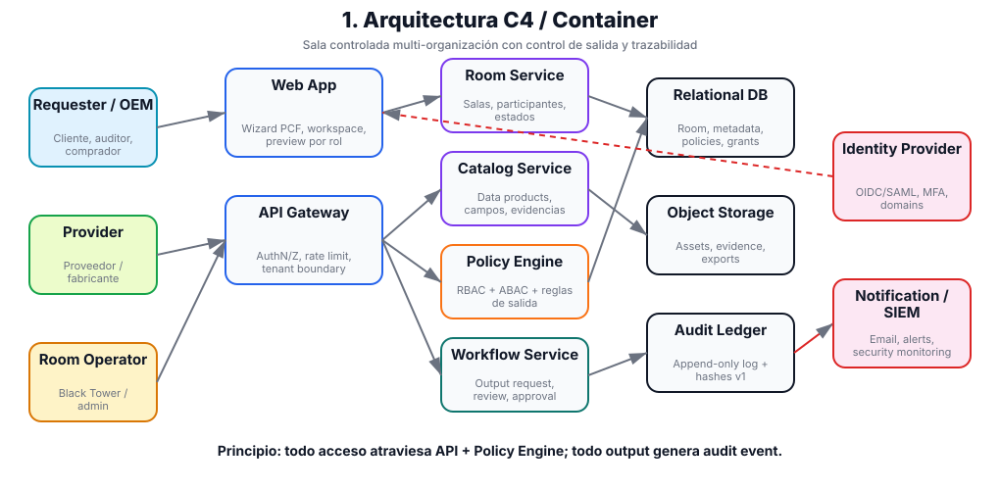
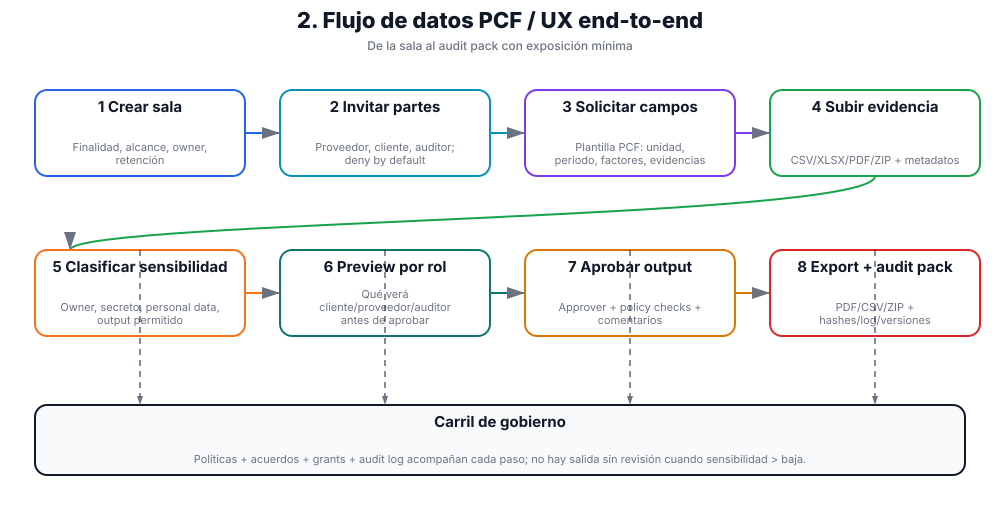
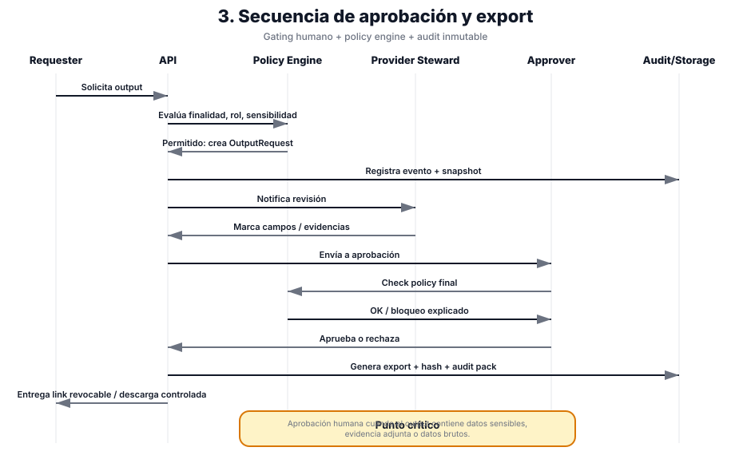
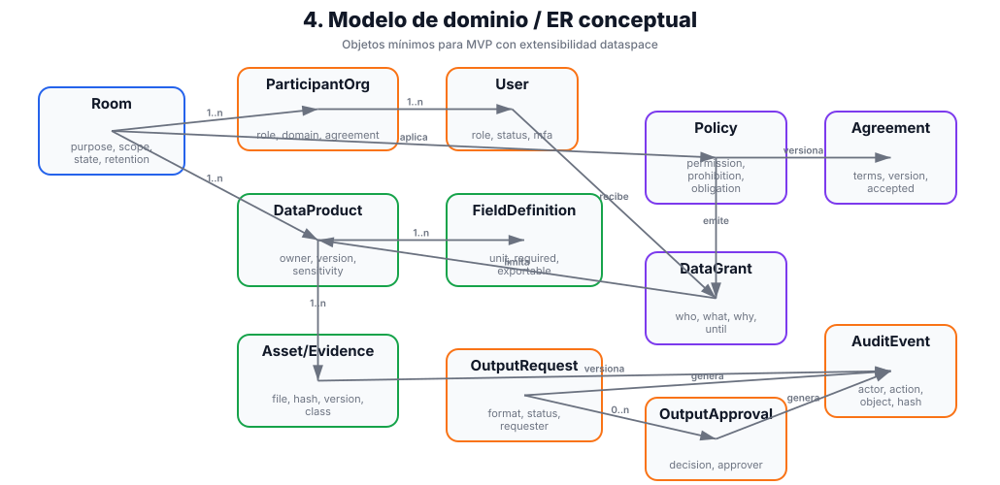
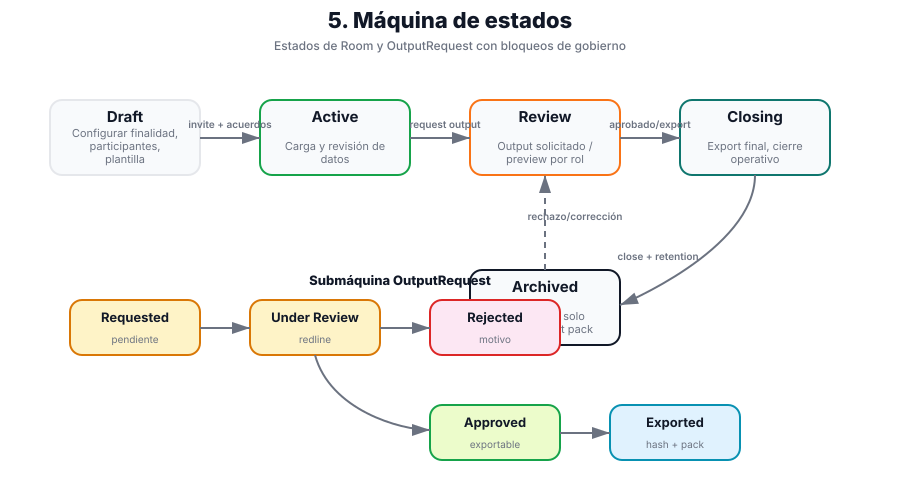
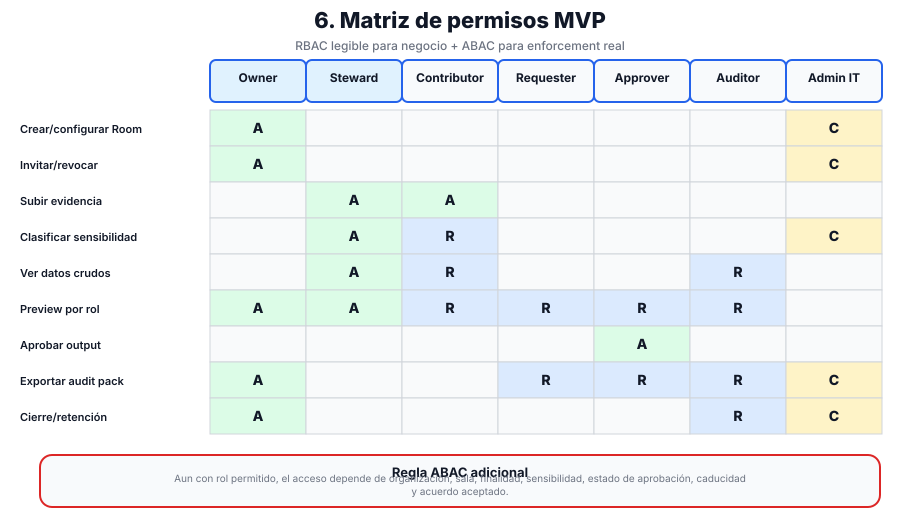
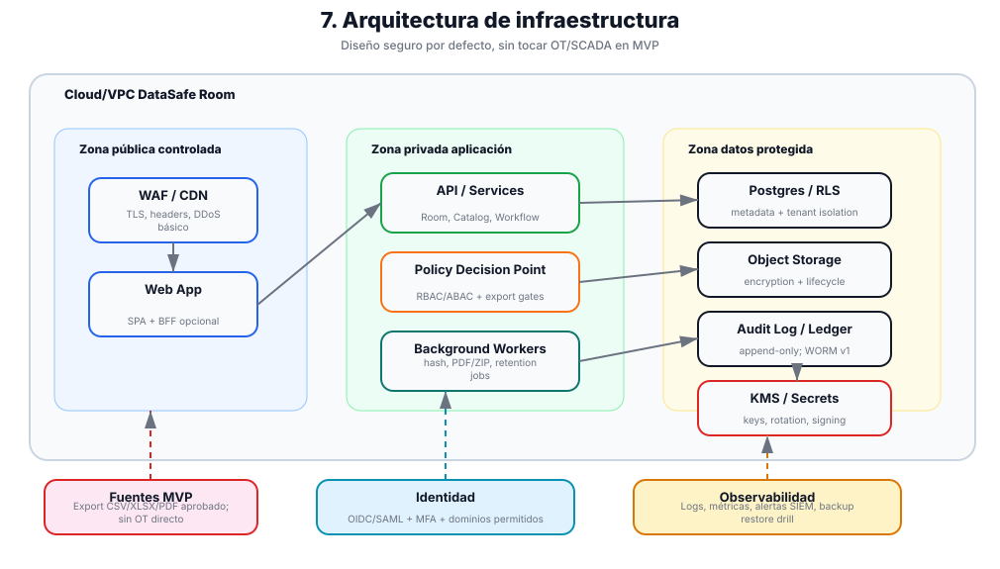
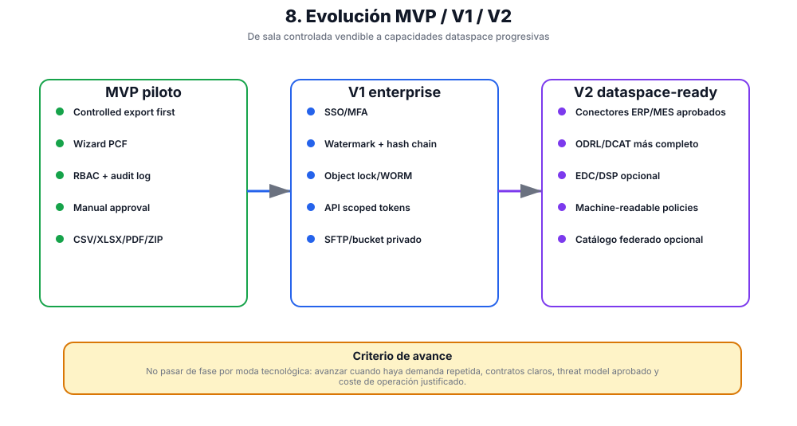

# DataSafe Room — Especificación técnica de componentes

> **Documento interno para Ventura / Black Tower Consulting.** Esta especificación define cómo construir DataSafe Room como MVP técnico controlado. No es una promesa comercial, legal, de compliance ni de integración industrial productiva.

## 0. Decisión técnica ejecutiva

**Construir primero un monolito modular + workers + storage privado**, no un dataspace federado completo.

La arquitectura recomendada para el MVP es:

- **Frontend:** React/Vite o Next.js + TypeScript. Para continuar desde la landing actual, React/Vite es suficiente; Next.js solo si se quiere SSR/app router desde el inicio.
- **Backend MVP recomendado:** FastAPI + SQLAlchemy/Alembic por velocidad, OpenAPI y facilidad de prototipado. Alternativa enterprise: Kotlin/Spring Boot si Ventura quiere maximizar alineación con stack backend corporativo.
- **DB:** PostgreSQL.
- **Object storage:** S3 compatible / MinIO.
- **Identidad:** Keycloak/OIDC desde piloto real; auth mock solo para demo sintética.
- **Workers:** cola simple con Redis/RQ/Celery/Arq o tabla `jobs` al principio.
- **PDF/ZIP/CSV generation:** workers de export/audit pack.
- **Infra:** app privada detrás de TLS/WAF/LB, DB/storage privados, secrets manager, backups y observabilidad básica.

Principio de alcance:

- **MVP:** controlled export first con CSV/XLSX/PDF/ZIP subidos manualmente, clasificación, permisos, aprobación, audit log y audit pack.
- **V1:** SSO/MFA, watermarking, antimalware, DLP básico, hash chain/WORM lógico, SIEM/webhooks, API scoped tokens.
- **V2:** EDC/DSP, catálogo federado, ODRL/DCAT formal y conectores ERP/MES/PLM solo si el mercado lo justifica.

## 1. Diagramas principales

### 1.1 Arquitectura C4 / Container



Decisión: todo acceso pasa por **API + Policy Engine**. Ningún usuario ni servicio accede directamente a datos sin autorización, política y auditoría.

### 1.2 Flujo de datos PCF end-to-end



Decisión: el usuario no compra “dataspace”; usa una sala con campos, evidencias, clasificación, preview, aprobación y audit pack.

### 1.3 Secuencia approval/export



Decisión: exportar es un workflow, no un botón. Hay policy check, review, aprobación, generación de artefactos, hash y audit event.

### 1.4 Modelo de dominio / ER conceptual



Decisión: `Room` es el aggregate operativo; `Policy`, `Agreement`, `DataGrant`, `OutputRequest` y `AuditEvent` separan regla, contrato, autorización, salida y evidencia.

### 1.5 Máquina de estados



Decisión: no permitir estados ambiguos. Lo que no está en un estado válido no se exporta.

### 1.6 Matriz de permisos MVP



Decisión: RBAC visible para negocio, ABAC real para enforcement técnico.

### 1.7 Infraestructura



Decisión: zona pública mínima, app privada, datos protegidos, KMS/secrets y SIEM/alerts como hardening progresivo.

### 1.8 Roadmap técnico MVP / V1 / V2



Decisión: no saltar a federación hasta validar demanda repetida, contratos claros y threat model.

## 2. Bounded contexts y módulos backend

### 2.1 Identity and Access Adapter

Responsabilidad:

- Validar JWT/OIDC.
- Resolver usuario actual.
- Mapear claims de Keycloak a roles globales, roles de organización y roles por sala.
- Gestionar impersonation/support solo si se implementa con aprobación, ventana temporal y auditoría visible.

Componentes:

- `AuthMiddleware`.
- `CurrentUserResolver`.
- `ClaimMapper`.
- `PermissionContextBuilder`.

No-go:

- No gestionar passwords localmente.
- No confiar en permisos del frontend.

### 2.2 Organization Service

Responsabilidad:

- Gestionar organizaciones participantes.
- Gestionar pertenencia usuario-organización.
- Validar que una organización puede participar en una sala.

Tablas:

- `organizations`.
- `organization_members`.
- `users` si se replica mínimo desde OIDC.

Endpoints:

- `GET /api/v1/organizations`.
- `POST /api/v1/organizations`.
- `GET /api/v1/organizations/{org_id}`.
- `PATCH /api/v1/organizations/{org_id}`.
- `GET /api/v1/organizations/{org_id}/members`.
- `POST /api/v1/organizations/{org_id}/members`.

Eventos:

- `organization.created`.
- `organization.updated`.
- `organization.member.added`.
- `organization.member.removed`.

### 2.3 Room Service

Responsabilidad:

- Crear y gobernar salas.
- Definir finalidad, alcance, fechas, owner, retención y estado.
- Asociar participantes y miembros.
- Impedir que una sala pase a `active` sin configuración mínima.

Tablas:

- `rooms`.
- `room_participants`.
- `room_memberships`.
- `room_lifecycle_events`.

Estados:

- `draft`.
- `configured`.
- `active`.
- `review`.
- `closing`.
- `closed`.
- `archived`.
- `suspended`.
- `revoked`.

Endpoints:

- `GET /api/v1/rooms`.
- `POST /api/v1/rooms`.
- `GET /api/v1/rooms/{room_id}`.
- `PATCH /api/v1/rooms/{room_id}`.
- `POST /api/v1/rooms/{room_id}/activate`.
- `POST /api/v1/rooms/{room_id}/suspend`.
- `POST /api/v1/rooms/{room_id}/close`.
- `POST /api/v1/rooms/{room_id}/archive`.

Eventos:

- `room.created`.
- `room.updated`.
- `room.activated`.
- `room.suspended`.
- `room.closed`.
- `room.archived`.
- `room.participant.added`.
- `room.member.role_changed`.

### 2.4 Data Product Registry

Responsabilidad:

- Registrar datasets lógicos dentro de una sala.
- Versionar esquemas/campos.
- Conectar datos y evidencias con owner, sensibilidad, finalidad y salida permitida.

Tablas:

- `data_products`.
- `data_product_versions`.
- `field_definitions`.
- `classifications`.
- `data_product_assets`.

Endpoints:

- `GET /api/v1/rooms/{room_id}/data-products`.
- `POST /api/v1/rooms/{room_id}/data-products`.
- `GET /api/v1/rooms/{room_id}/data-products/{data_product_id}`.
- `PATCH /api/v1/rooms/{room_id}/data-products/{data_product_id}`.
- `POST /api/v1/rooms/{room_id}/data-products/{data_product_id}/versions`.
- `PUT /api/v1/rooms/{room_id}/data-products/{data_product_id}/versions/{version_id}/fields`.
- `POST /api/v1/rooms/{room_id}/data-products/{data_product_id}/versions/{version_id}/publish`.

Eventos:

- `data_product.created`.
- `data_product.version.created`.
- `field_definitions.updated`.
- `classification.assigned`.
- `data_product.version.published`.

Validaciones:

- No publicar sin field definitions.
- No publicar sin owner.
- No exportar campos `allowed_export=false`.
- Cada campo debe tener sensibilidad y decisión de salida antes del export.

### 2.5 Asset and Evidence Service

Responsabilidad:

- Gestionar archivos, evidencias, documentos y datasets subidos.
- Generar URLs firmadas.
- Calcular hash/checksum.
- Validar MIME, tamaño, allowlist y estado.
- Guardar objetos en storage privado.

Tablas:

- `assets`.
- `asset_versions`.
- `asset_links`.

Estructura storage recomendada:

```text
rooms/{room_id}/data-products/{data_product_id}/versions/{version_id}/{asset_id}
rooms/{room_id}/outputs/{output_request_id}/{asset_id}
rooms/{room_id}/audit-packs/{audit_pack_id}/{asset_id}
rooms/{room_id}/quarantine/{asset_id}
```

Endpoints:

- `POST /api/v1/rooms/{room_id}/assets/upload-url`.
- `POST /api/v1/rooms/{room_id}/assets/complete-upload`.
- `GET /api/v1/rooms/{room_id}/assets`.
- `GET /api/v1/rooms/{room_id}/assets/{asset_id}`.
- `GET /api/v1/rooms/{room_id}/assets/{asset_id}/download-url`.
- `POST /api/v1/rooms/{room_id}/assets/{asset_id}/block`.
- `POST /api/v1/rooms/{room_id}/assets/{asset_id}/revoke`.

Eventos:

- `asset.upload_url.created`.
- `asset.upload.completed`.
- `asset.checksum.verified`.
- `asset.blocked`.
- `asset.revoked`.
- `asset.download_url.created`.
- `asset.downloaded`.

### 2.6 Policy and Agreement Service

Responsabilidad:

- Gestionar reglas de acceso, salida, aprobación, clasificación y retención.
- Versionar acuerdos humanos/legales vinculados a políticas técnicas.
- Emitir snapshots usados por output requests.

Tablas:

- `policies`.
- `policy_rules`.
- `agreements`.
- `agreement_parties`.
- `agreement_acceptances`.

Tipos de políticas:

- `access_policy`.
- `export_policy`.
- `approval_policy`.
- `classification_policy`.
- `retention_policy`.

Efectos:

- `allow`.
- `deny`.
- `require_approval`.
- `require_masking`.
- `require_legal_review`.

Endpoints:

- `GET /api/v1/rooms/{room_id}/policies`.
- `POST /api/v1/rooms/{room_id}/policies`.
- `PATCH /api/v1/rooms/{room_id}/policies/{policy_id}`.
- `POST /api/v1/rooms/{room_id}/policies/{policy_id}/activate`.
- `POST /api/v1/rooms/{room_id}/agreements`.
- `POST /api/v1/rooms/{room_id}/agreements/{agreement_id}/accept`.

### 2.7 Output Request Service

Responsabilidad:

- Orquestar solicitudes de salida: informe, CSV, ZIP, PDF, vista controlada o audit pack.
- Congelar snapshot de políticas al submit.
- Evaluar reglas.
- Crear tareas de aprobación.
- Invocar export builder si se aprueba.

Tablas:

- `output_requests`.
- `output_request_items`.
- `export_contracts`.
- `output_artifacts`.

Estados:

- `draft`.
- `submitted`.
- `policy_check_pending`.
- `policy_check_failed`.
- `approval_pending`.
- `approved`.
- `rejected`.
- `export_building`.
- `export_ready`.
- `export_downloaded`.
- `revoked`.
- `expired`.

Endpoints:

- `GET /api/v1/rooms/{room_id}/output-requests`.
- `POST /api/v1/rooms/{room_id}/output-requests`.
- `GET /api/v1/rooms/{room_id}/output-requests/{request_id}`.
- `PATCH /api/v1/rooms/{room_id}/output-requests/{request_id}`.
- `POST /api/v1/rooms/{room_id}/output-requests/{request_id}/submit`.
- `POST /api/v1/rooms/{room_id}/output-requests/{request_id}/policy-check`.
- `GET /api/v1/rooms/{room_id}/output-requests/{request_id}/export-contract`.
- `GET /api/v1/rooms/{room_id}/output-requests/{request_id}/artifacts`.
- `GET /api/v1/rooms/{room_id}/output-requests/{request_id}/download-url`.

### 2.8 Approval Service

Responsabilidad:

- Crear tareas de aprobación.
- Asignar aprobadores por organización/rol.
- Registrar decisión, comentario, timestamp y actor.
- Soportar modelos de aprobación simples.

Tablas:

- `approval_tasks`.
- `approval_decisions`.

Modelos MVP:

- `single_owner_approval`.
- `two_party_approval`.
- `all_data_owners_approval`.

Endpoints:

- `GET /api/v1/rooms/{room_id}/approval-tasks`.
- `POST /api/v1/rooms/{room_id}/approval-tasks/{task_id}/approve`.
- `POST /api/v1/rooms/{room_id}/approval-tasks/{task_id}/reject`.

Reglas:

- No doble decisión.
- Rechazo requiere comentario.
- Separación de funciones si la política lo exige: quien sube evidencia sensible no aprueba salida externa.

### 2.9 Audit Service

Responsabilidad:

- Registrar eventos críticos.
- Mantener payloads resumidos, nunca datasets completos.
- Construir audit packs.
- Exponer consulta/export de eventos según permisos.

Tablas:

- `audit_events`.
- `audit_packs`.
- `audit_pack_items`.

Campos obligatorios de `audit_events`:

- `event_type`.
- `occurred_at`.
- `actor_user_id`.
- `actor_org_id`.
- `room_id`.
- `entity_type`.
- `entity_id`.
- `correlation_id`.
- `ip_address`.
- `user_agent`.
- `payload`.
- `previous_hash`.
- `hash`.

Endpoints:

- `GET /api/v1/rooms/{room_id}/audit-events`.
- `POST /api/v1/rooms/{room_id}/audit-packs`.
- `GET /api/v1/rooms/{room_id}/audit-packs/{audit_pack_id}`.
- `GET /api/v1/rooms/{room_id}/audit-packs/{audit_pack_id}/download-url`.

### 2.10 Retention and Revocation Service

Responsabilidad:

- Expirar accesos y outputs.
- Revocar usuarios, assets, grants y outputs.
- Cerrar/archivar sala según política.
- Ejecutar jobs de limpieza/bloqueo.

Tablas:

- `retention_rules`.
- `revocations`.
- `access_grants`.

Endpoints:

- `POST /api/v1/rooms/{room_id}/revocations`.
- `GET /api/v1/rooms/{room_id}/revocations`.
- `GET /api/v1/rooms/{room_id}/retention-status`.

Eventos:

- `revocation.created`.
- `revocation.applied`.
- `retention.expiration.detected`.
- `retention.asset.blocked`.

## 3. Modelo de datos mínimo

### 3.1 Tablas core

```text
organizations
- id uuid pk
- name text
- legal_name text null
- external_ref text null
- status enum(active, suspended, archived)
- created_at timestamptz
- updated_at timestamptz

users
- id uuid pk
- oidc_subject text unique
- email text
- display_name text
- status enum(active, disabled)
- created_at timestamptz
- updated_at timestamptz

organization_members
- id uuid pk
- organization_id uuid fk
- user_id uuid fk
- role enum(org_admin, data_owner, reviewer, analyst, auditor)
- created_at timestamptz

rooms
- id uuid pk
- name text
- description text
- purpose text
- owner_organization_id uuid fk
- status enum
- classification_level enum(public, internal, confidential, restricted)
- retention_until timestamptz null
- created_by uuid fk
- created_at timestamptz
- updated_at timestamptz

room_participants
- id uuid pk
- room_id uuid fk
- organization_id uuid fk
- participant_type enum(owner, contributor, consumer, auditor)
- status enum(invited, active, suspended, removed)
- joined_at timestamptz null

room_memberships
- id uuid pk
- room_id uuid fk
- user_id uuid fk
- organization_id uuid fk
- room_role enum(room_admin, data_owner, contributor, reviewer, analyst, auditor)
- status enum(active, suspended, removed)
- created_at timestamptz
```

### 3.2 Tablas de datos, evidencias y políticas

```text
data_products
- id uuid pk
- room_id uuid fk
- owning_organization_id uuid fk
- name text
- description text
- status enum(draft, active, deprecated, revoked)
- classification_id uuid fk
- created_by uuid fk
- created_at timestamptz
- updated_at timestamptz

data_product_versions
- id uuid pk
- data_product_id uuid fk
- version text
- schema_hash text
- status enum(draft, published, revoked)
- published_at timestamptz null

field_definitions
- id uuid pk
- data_product_version_id uuid fk
- field_name text
- field_type text
- unit text null
- description text null
- classification enum(public, internal, confidential, restricted)
- is_pii boolean default false
- is_trade_secret boolean default false
- allowed_export boolean default true
- masking_rule text null

assets
- id uuid pk
- room_id uuid fk
- owner_organization_id uuid fk
- asset_type enum(dataset, evidence, document, output, audit_pack)
- storage_bucket text
- storage_key text
- filename text
- mime_type text
- size_bytes bigint
- sha256 text
- status enum(upload_pending, available, blocked, revoked, deleted)
- created_by uuid fk
- created_at timestamptz

policies
- id uuid pk
- room_id uuid fk
- name text
- policy_type enum(access_policy, export_policy, approval_policy, classification_policy, retention_policy)
- status enum(draft, active, superseded, disabled)
- version integer
- created_by uuid fk
- created_at timestamptz

policy_rules
- id uuid pk
- policy_id uuid fk
- rule_type enum(export_limit, approval_required, field_block, retention_limit, purpose_required)
- condition jsonb
- effect enum(allow, deny, require_approval, require_masking, require_legal_review)
- priority integer
```

### 3.3 Tablas de salida, aprobación y auditoría

```text
agreements
- id uuid pk
- room_id uuid fk
- title text
- version integer
- status enum(draft, active, expired, revoked)
- effective_from timestamptz
- effective_until timestamptz null
- document_asset_id uuid fk null

agreement_parties
- id uuid pk
- agreement_id uuid fk
- organization_id uuid fk
- party_role enum(provider, consumer, auditor, controller, processor)
- accepted_at timestamptz null
- accepted_by uuid fk null

output_requests
- id uuid pk
- room_id uuid fk
- requesting_organization_id uuid fk
- requested_by uuid fk
- title text
- purpose text
- status enum
- classification_snapshot jsonb
- policy_evaluation_result jsonb null
- expires_at timestamptz null
- created_at timestamptz
- updated_at timestamptz
- submitted_at timestamptz null

output_request_items
- id uuid pk
- output_request_id uuid fk
- data_product_id uuid fk
- data_product_version_id uuid fk
- requested_fields jsonb
- filters jsonb null
- transformations jsonb null

export_contracts
- id uuid pk
- output_request_id uuid fk
- contract_version text
- format enum(csv, parquet, jsonl, zip, pdf)
- field_manifest jsonb
- policy_snapshot jsonb
- allowed_use text
- retention_until timestamptz null
- watermark_required boolean
- checksum_algorithm text default sha256
- created_at timestamptz

approval_tasks
- id uuid pk
- output_request_id uuid fk
- assigned_to_user_id uuid null
- assigned_to_org_id uuid null
- required_role text
- status enum(pending, approved, rejected, cancelled, expired)
- due_at timestamptz null
- created_at timestamptz

approval_decisions
- id uuid pk
- approval_task_id uuid fk
- decision enum(approved, rejected)
- comment text null
- decided_by uuid fk
- decided_at timestamptz

audit_events
- id uuid pk
- occurred_at timestamptz
- event_type text
- actor_user_id uuid null
- actor_org_id uuid null
- room_id uuid null
- entity_type text
- entity_id uuid null
- ip_address inet null
- user_agent text null
- correlation_id uuid
- payload jsonb
- hash text
- previous_hash text null
```

## 4. Policy Engine

### 4.1 Decisión de autorización

Toda acción crítica debe evaluar:

```text
subject = usuario + organización + rol global + rol en sala
resource = room/data_product/asset/output/audit_event
action = view/create/update/delete/submit/approve/export/download/revoke
context = finalidad + sensibilidad + estado + acuerdo + caducidad + IP/riesgo
```

Resultado posible:

- `allow`.
- `deny`.
- `require_approval`.
- `require_masking`.
- `require_legal_review`.

### 4.2 ABAC mínimo MVP

Reglas obligatorias:

- Usuario no pertenece a la sala → `deny`.
- Organización suspendida → `deny`.
- Sala no activa → bloquear outputs nuevos.
- Asset no disponible o revocado → `deny`.
- Campo sin clasificación → `deny export`.
- Campo `is_trade_secret=true` → `require_approval` o `deny` según policy.
- Campo `is_pii=true` → `require_legal_review` o `masking`.
- Agreement no aceptado → `deny export`.
- Output expirado → `deny download`.

### 4.3 Tests de policy engine

- Permitir contributor subir evidencia propia.
- Denegar contributor ver evidencia de otra organización.
- Denegar requester ver campos internos.
- Requerir aprobación para export de secreto industrial.
- Requerir masking para PII.
- Denegar descarga tras revocación.

## 5. Workers, jobs y procesamiento asíncrono

### 5.1 `policy_evaluation_worker`

Trigger:

- `output_request.submitted`.
- Endpoint manual `POST /policy-check`.

Funciones:

- Validar clasificación.
- Validar acuerdo activo.
- Validar campos solicitados.
- Evaluar reglas.
- Crear approval tasks si aplica.
- Guardar `policy_evaluation_result`.

### 5.2 `asset_integrity_worker`

Trigger:

- Upload completado.

Funciones:

- Verificar objeto en storage.
- Calcular SHA256.
- Validar tamaño/MIME.
- Mover de `quarantine` a `available` si pasa.
- Marcar `blocked` si falla.

### 5.3 `export_builder_worker`

Trigger:

- Output request aprobada.

Funciones:

- Leer assets/datasets autorizados.
- Aplicar field manifest.
- Excluir/mask campos bloqueados.
- Generar CSV/JSON/PDF/ZIP según contrato.
- Generar `manifest.json`, `field_manifest.json`, `policy_snapshot.json`, `approval_snapshot.json`, `checksums.txt`.
- Guardar artefactos en storage privado.
- Registrar `output_artifacts`.

### 5.4 `audit_pack_worker`

Trigger:

- Solicitud de audit pack o cierre de sala.

Funciones:

- Recopilar eventos filtrados.
- Incluir snapshots de políticas/acuerdos/aprobaciones.
- Incluir checksums y manifest.
- Generar ZIP/PDF.
- Registrar evento y asset.

### 5.5 Jobs periódicos

- `retention_expiration_job`: expira outputs, links y assets según política.
- `approval_deadline_job`: expira aprobaciones pendientes.
- `revocation_apply_job`: aplica revocaciones pendientes.
- `audit_hash_chain_job`: verifica cadena hash si se implementa.
- `backup_verification_job`: test de restauración programada en sandbox/piloto.

## 6. Contrato de export

Cada export aprobado debe producir estructura estable:

```text
export-{output_request_id}.zip
├── data/
│   └── export.csv | export.parquet | export.jsonl
├── documents/
│   └── evidence-approved.pdf
├── manifest.json
├── field_manifest.json
├── policy_snapshot.json
├── approval_snapshot.json
├── checksums.txt
└── README.md
```

### 6.1 `manifest.json`

```json
{
  "contract_version": "1.0",
  "output_request_id": "uuid",
  "room_id": "uuid",
  "generated_at": "2026-05-07T00:00:00Z",
  "format": "zip",
  "classification": "confidential",
  "retention_until": "2026-08-07T00:00:00Z",
  "allowed_use": "Purpose approved in output request",
  "source_data_products": [
    {
      "data_product_id": "uuid",
      "version_id": "uuid",
      "name": "PCF supplier evidence",
      "version": "1.0"
    }
  ],
  "artifacts": [
    {
      "path": "data/export.csv",
      "mime_type": "text/csv",
      "sha256": "..."
    }
  ]
}
```

### 6.2 `field_manifest.json`

```json
{
  "fields": [
    {
      "name": "product_id",
      "classification": "public",
      "exported": true,
      "masking_applied": false
    },
    {
      "name": "internal_cost",
      "classification": "restricted",
      "exported": false,
      "reason": "Field blocked by export policy"
    }
  ]
}
```

### 6.3 `approval_snapshot.json`

```json
{
  "approval_model": "two_party_approval",
  "decisions": [
    {
      "task_id": "uuid",
      "organization_id": "uuid",
      "decision": "approved",
      "decided_by": "uuid",
      "decided_at": "2026-05-07T00:00:00Z",
      "comment": "Approved for stated purpose"
    }
  ]
}
```

## 7. Infraestructura y despliegue

### 7.1 Entornos

- **Demo:** datos sintéticos, auth simple o Keycloak dev, banner “demo/no productivo”, reset periódico.
- **Sandbox:** QA técnico, datos sintéticos/mascarados, scanners, migraciones, backup/restore.
- **Piloto:** datos reales exportados y aprobados, MFA/SSO si disponible, NDA/DSA/DPA si aplica, retención definida.
- **Producción:** hardening, monitorización, backup probado, SIEM/webhooks, runbooks, separación estricta de tenants.

### 7.2 Red

- Internet solo llega a WAF/LB/TLS.
- API y workers en red privada.
- DB y storage sin acceso público.
- Egress restringido para workloads de datos.
- Admin por VPN/ZTNA/bastion gestionado; no SSH público.
- Sin conectividad OT/PLC/SCADA/MES/ERP en MVP.

### 7.3 Storage

Buckets/prefijos:

```text
quarantine/{room_id}/...
raw/{room_id}/...
curated/{room_id}/...
outputs/{room_id}/...
audit-packs/{room_id}/...
```

Controles:

- Cifrado en reposo.
- URLs firmadas de corta duración.
- No buckets públicos.
- Checksum post-upload.
- Lifecycle por retención.
- Object lock/WORM en V1 si hay demanda.

### 7.4 Secrets y KMS

MVP:

- Variables gestionadas por plataforma/secret manager.
- Nada de secretos en repo/frontend/logs.
- Rotación manual documentada.

V1:

- KMS gestionado.
- Rotación automática.
- Claves por tenant si el mercado lo exige.
- BYOK solo enterprise maduro.

### 7.5 Headers web mínimos

- `Strict-Transport-Security`.
- `Content-Security-Policy`.
- `X-Content-Type-Options: nosniff`.
- `Referrer-Policy`.
- `Permissions-Policy`.
- `frame-ancestors 'none'` salvo embedding pactado.
- Cookies `HttpOnly`, `Secure`, `SameSite=Lax/Strict` si hay sesión cookie.

## 8. Observabilidad, auditoría y alertas

### 8.1 Logs técnicos

- Request ID / correlation ID.
- Actor y organización, sin datos sensibles completos.
- Latencia por endpoint.
- Errores por servicio.
- Estado de workers.
- Fallos de storage/db/policy.

### 8.2 Audit events funcionales

Eventos mínimos:

- Login/acceso relevante.
- Sala creada/activada/cerrada.
- Participante añadido/revocado.
- Dataset/evidencia subido/versionado.
- Clasificación cambiada.
- Policy/agreement aceptado.
- Output solicitado/revisado/aprobado/rechazado/exportado/descargado.
- Revocación/retención aplicada.

### 8.3 Alertas P1/V1

- Descarga masiva.
- Acceso desde país/IP nuevo.
- Múltiples fallos login.
- Export bloqueado repetido.
- Cambio tras aprobación.
- Worker fallando export/audit pack.
- Error de backup/restore.

## 9. Seguridad de uploads y outputs

### 9.1 Upload controlado

MVP:

- Allowlist de extensiones/MIME.
- Límite de tamaño.
- Storage privado.
- Checksum.
- Revisión manual antes de output.
- Bloqueo de ZIP anidados/macros salvo justificación.

V1:

- Antimalware automático.
- DLP básico.
- Preview segura.
- Sanitización/stripping de metadatos.

### 9.2 Output controls

MVP:

- Preview por rol.
- Export bloqueado si faltan clasificación/aprobación/acuerdo.
- Exclusión técnica de campos internos.
- README/disclaimer incluido.
- Checksum de artefactos.

V1:

- Watermarking.
- Hash chain.
- Object lock/WORM.
- DLP configurable.
- Vistas online revocables.

## 10. Flujos críticos

### 10.1 Crear sala

1. Room Owner crea sala.
2. Define finalidad, alcance, retención y participantes.
3. Invita organizaciones.
4. Activa políticas iniciales.
5. Sala pasa a `active`.

Bloqueos:

- No activar sin finalidad.
- No activar sin al menos dos organizaciones si es colaboración inter-org.
- No activar sin políticas mínimas.

### 10.2 Registrar data product

1. Data Owner crea data product.
2. Sube evidencia/dataset.
3. Define fields.
4. Clasifica sensibilidad.
5. Publica versión.

Bloqueos:

- No publicar sin owner.
- No publicar sin fields.
- No publicar si assets están pendientes o bloqueados.

### 10.3 Solicitar output

1. Requester crea output request.
2. Declara finalidad.
3. Selecciona campos/versiones.
4. Policy worker evalúa.
5. Approval tasks se crean.
6. Approver aprueba/rechaza.
7. Export builder genera artefactos.
8. Requester descarga por URL firmada.

Bloqueos:

- No descargar si no está aprobado.
- No descargar si expiró/revocado.
- No descargar si sala no activa.
- No exportar campos sin clasificación.

### 10.4 Cierre y retención

1. Room Owner solicita cierre.
2. Sistema bloquea nuevas cargas.
3. Se genera audit pack final.
4. Se revocan accesos externos no necesarios.
5. Se archiva o borra según retención.

## 11. API REST resumen

Base path: `/api/v1`.

```text
GET    /me
GET    /organizations
POST   /organizations
GET    /organizations/{org_id}/members
POST   /organizations/{org_id}/members

GET    /rooms
POST   /rooms
GET    /rooms/{room_id}
PATCH  /rooms/{room_id}
POST   /rooms/{room_id}/activate
POST   /rooms/{room_id}/suspend
POST   /rooms/{room_id}/close

GET    /rooms/{room_id}/participants
POST   /rooms/{room_id}/participants
GET    /rooms/{room_id}/members
POST   /rooms/{room_id}/members

GET    /rooms/{room_id}/data-products
POST   /rooms/{room_id}/data-products
GET    /rooms/{room_id}/data-products/{data_product_id}
PATCH  /rooms/{room_id}/data-products/{data_product_id}
POST   /rooms/{room_id}/data-products/{data_product_id}/versions
PUT    /rooms/{room_id}/data-products/{data_product_id}/versions/{version_id}/fields
POST   /rooms/{room_id}/data-products/{data_product_id}/versions/{version_id}/publish

POST   /rooms/{room_id}/assets/upload-url
POST   /rooms/{room_id}/assets/complete-upload
GET    /rooms/{room_id}/assets
GET    /rooms/{room_id}/assets/{asset_id}/download-url
POST   /rooms/{room_id}/assets/{asset_id}/block
POST   /rooms/{room_id}/assets/{asset_id}/revoke

GET    /rooms/{room_id}/policies
POST   /rooms/{room_id}/policies
POST   /rooms/{room_id}/policies/{policy_id}/activate
GET    /rooms/{room_id}/agreements
POST   /rooms/{room_id}/agreements
POST   /rooms/{room_id}/agreements/{agreement_id}/accept

GET    /rooms/{room_id}/output-requests
POST   /rooms/{room_id}/output-requests
GET    /rooms/{room_id}/output-requests/{request_id}
POST   /rooms/{room_id}/output-requests/{request_id}/submit
POST   /rooms/{room_id}/output-requests/{request_id}/policy-check
GET    /rooms/{room_id}/output-requests/{request_id}/download-url

GET    /rooms/{room_id}/approval-tasks
POST   /rooms/{room_id}/approval-tasks/{task_id}/approve
POST   /rooms/{room_id}/approval-tasks/{task_id}/reject

GET    /rooms/{room_id}/audit-events
POST   /rooms/{room_id}/audit-packs
GET    /rooms/{room_id}/audit-packs/{audit_pack_id}/download-url

POST   /rooms/{room_id}/revocations
GET    /rooms/{room_id}/retention-status
```

## 12. Frontend técnico

### 12.1 Módulos UI

- Dashboard de salas.
- Wizard de creación de sala.
- Participantes y roles.
- Data product registry.
- Upload/evidence manager.
- Field classification grid.
- Policy/agreement view.
- Output request inbox.
- Approval queue.
- Role preview.
- Audit timeline.
- Audit pack/download center.
- Retention/closure panel.

### 12.2 Estado cliente

- TanStack Query para server state.
- Zod schemas compartidos o generados desde OpenAPI.
- Forms con React Hook Form.
- Feature flags para demo vs piloto.
- Nunca confiar en frontend para permisos: UI oculta acciones, backend decide.

### 12.3 UX gates obligatorios

- Banner “demo/no datos productivos” en demo.
- Warning antes de subir datos reales.
- Preview por rol antes de export.
- Checklist visible: owner, sensibilidad, aprobación, acuerdo, retención.
- Mensajes explícitos de “no certifica compliance / no PCF certificado”.

## 13. Testing y QA técnico

### 13.1 Unit tests

- Policy engine: allow/deny/approval/masking.
- State machines.
- Field classification rules.
- Retention expiration.
- Export manifest generation.
- Hash/checksum generation.

### 13.2 Integration tests

- Crear sala con dos organizaciones.
- Registrar data product y fields.
- Subir asset y verificar checksum.
- Solicitar output.
- Policy check crea approval tasks.
- Aprobar output.
- Generar export ZIP.
- Descargar por URL firmada.
- Revocar output y verificar bloqueo.

### 13.3 Security tests

- `401` sin token.
- `403` con rol insuficiente.
- Org A no ve org B.
- Auditor ve logs pero no datasets.
- Contributor no aprueba su propio output si política lo impide.
- URL firmada expira.
- Asset revocado no genera download URL.

### 13.4 QA gates antes de piloto real

- Permisos cruzados probados.
- Export bloquea campos no clasificados.
- Export excluye campos internos por regla técnica.
- Audit log reconstruye versiones y aprobaciones.
- Retención y cierre configurados.
- Backup/restore probado o documentado.
- Secrets fuera de repo/frontend/logs.
- Headers web mínimos configurados.
- No hay conexión OT/ERP/MES/SCADA.

## 14. CI/CD y operaciones

### 14.1 Pipeline mínimo

1. Lint/typecheck frontend.
2. Tests backend.
3. Migraciones validate.
4. Build Docker images.
5. Scan dependencias/containers.
6. Deploy sandbox.
7. Smoke tests.
8. Deploy piloto/prod con approval manual.

### 14.2 Migraciones

- Alembic/Flyway/Liquibase según stack.
- Backups antes de migraciones en piloto/prod.
- Rollback plan por release.
- No migrations destructivas sin revisión.

### 14.3 Runbooks

- Crear tenant/organización.
- Revocar usuario externo.
- Cerrar sala.
- Regenerar audit pack.
- Rotar secreto.
- Restaurar backup.
- Contener incidente de export erróneo.

## 15. Threat model resumido

### Amenazas principales

- Exfiltración por export mal configurado.
- Usuario externo comprometido.
- Proveedor ve datos de otro proveedor.
- Dataset contiene PII o secreto no clasificado.
- Asset con malware/macros.
- Logs insuficientes para reconstruir decisión.
- Retención indefinida.
- Integración OT/IT prematura.

### Mitigaciones MVP

- Deny-by-default.
- RBAC + ABAC centralizado.
- Clasificación obligatoria.
- Export approval.
- URLs firmadas.
- Storage privado.
- Audit log funcional.
- Retención/cierre.
- Controlled Export First.

### Mitigaciones V1

- MFA/SSO.
- Antimalware/DLP.
- Watermark/hash chain.
- SIEM alerts.
- WORM/Object Lock.
- KMS avanzado.
- Pentest/revisión externa.

## 16. Backlog técnico priorizado

### P0 — base de demo técnica

- Mock auth o Keycloak dev.
- Rooms con participantes.
- Dataset sintético PCF.
- Data product y field definitions.
- Classification grid.
- Output request mock.
- Approval mock.
- Audit pack demo.
- Diagramas y documentación.

### P1 — MVP piloto real controlado

- Keycloak/OIDC real.
- PostgreSQL schema completo MVP.
- MinIO/S3 privado.
- Upload URLs firmadas.
- Asset integrity worker.
- Policy engine simple.
- Approval workflow real.
- Export builder ZIP/CSV/PDF.
- Audit events funcionales.
- Retention/revocation básica.
- Tests API/security mínimos.

### P2 — V1 hardening

- SSO/MFA enterprise.
- Watermarking.
- Antimalware.
- DLP básico.
- Hash chain audit.
- SIEM/webhooks.
- API scoped tokens.
- Backup/restore automatizado.
- Audit pack robusto.

### P3 — Dataspace-ready

- DCAT/ODRL formal.
- EDC/DSP opcional.
- Catálogo federado.
- Verifiable credentials.
- Conectores ERP/MES/PLM read-only aprobados.
- OpenLineage.
- Compute-to-data real.

## 17. Criterio de aceptación del MVP técnico

DataSafe Room MVP está técnicamente aceptado cuando:

1. Se puede crear una sala con dos organizaciones y roles separados.
2. Un proveedor puede subir evidencia/dataset con owner, versión y clasificación.
3. Un requester puede solicitar output declarando finalidad.
4. El policy engine bloquea output si faltan clasificación, acuerdo o aprobación.
5. Un approver puede aprobar/rechazar con comentario.
6. El export builder genera ZIP/PDF/CSV con manifest, checksums y snapshots.
7. El audit log permite reconstruir quién hizo qué, cuándo y sobre qué versión.
8. La revocación corta accesos futuros.
9. Un usuario de otra organización no puede acceder a datos no autorizados.
10. No existe conexión directa a OT/ERP/MES/SCADA.

## 18. Decisiones abiertas

- **Backend definitivo:** FastAPI para velocidad o Spring Boot para alineación enterprise.
- **Frontend:** continuar con React/Vite o crear app Next.js separada.
- **Queue:** Redis/RQ/Celery/Arq o tabla `jobs` inicial.
- **Hosting:** Coolify actual para demo; cloud/VPC privada para piloto real sensible.
- **Formato export:** ZIP con CSV/PDF/JSON desde MVP o empezar solo PDF/audit pack.
- **Policy engine:** código propio simple en MVP; OPA/Cedar/ODRL en V1/V2.

## 19. Próxima acción técnica recomendada

Crear una **demo técnica PCF local-first** dentro de un repo/app separada o rama nueva:

1. Schema PostgreSQL mínimo.
2. API FastAPI con Rooms, Data Products, Output Requests y Audit Events.
3. UI React para flujo PCF.
4. MinIO local para evidencias.
5. Export ZIP con manifest/checksums.
6. Tests de permisos cruzados y export blocking.

No construir conectores ni federación hasta que el flujo controlado sea entendible, probado y vendible.

## 20. Fuentes internas usadas

- `docs/datasafe-room-dataspace-characteristics-2026-05-07.md`.
- `docs/product-strategy-backlog.md`.
- `docs/security-ot-review.md`.
- `docs/software/datasafe-room-technical-diagrams-ux-flow-2026-05-07.md`.
- Revisión delegada Daedalus/Backend Architect.
- Revisión delegada Aegis/Infra-Security Architect.
- Revisión delegada Mimir/Technical Diagrams + UX Flow.
